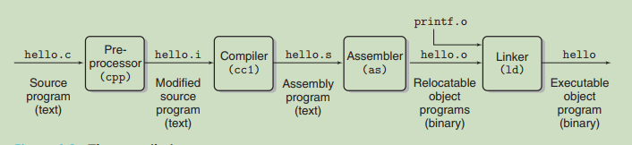

### Website

[CS 15-213](https://www.cs.cmu.edu/~213/index.html)

**Textbook** :  Computer Systems: A Programmer's Perspective, 3/E 

### Tips

[Tips on learning CS 15-213](https://csdiy.wiki/en/%E8%AE%A1%E7%AE%97%E6%9C%BA%E7%B3%BB%E7%BB%9F%E5%9F%BA%E7%A1%80/CSAPP/#descriptions)

```txt
If you have trouble with Chapter 7 Linking, I recommend reading the book Programmer's Self-Cultivation, subtitled link. load and library. This book can complete our understanding of program linking, and I believe after reading this book you will have a deeper comprehension of program linking, ELF files, and dynamic libraries. It is highly recommended to be read as a supplementary material after reading CSAPP and having a certain understanding of computer systems.
```

### Chapter 1. Tour of Computer Systems

#### 0, Programs are translated by other programs into different forms



gcc commands

```shell
# commands
# 1, hello.i
gcc -E hello.c -o hello.i / cpp hello.c -o hello.i # preprocessing 

# 2, hello.s
gcc -S hello.i  # translated into hello.s which is a assembly programme
# Or
gcc -S hello.c # skip the preprocess

# 3, hello.o
gcc -c hello.s -o hello.o  # relocatable object programs
# Or
as hello.s -o hello.o
# Or
gcc -c hello.c -o hello.o  # skip some steps

# 4, hello  
gcc hello.o -o hello # executable object program
```

#### 1, Shifting bits

In the low level of the computer system shifting bits is quite faster than multiplication. If the former costs one clock cycle, the latter will normally cost 13 to 17 clock cycles.  Nowadays the speed of multiplication has  increased dramatically but it still costs 4 clock cycles. While 4 is bigger than one anyway.

- What will happen if shifting 8 bits for a byte ?

#### 2, Signed and Unsigned

1. What will happened when a signed number is calculated with an unsigned number?
   The signed number will cast to a unsigned number. 

#### 3, Truncate a number

Truncating a number is like a module operation.

```txt
# 4 bits overflow so the most significant number is truncated.
1 1101 : 27
  1101 : 11   #27 % 16 = 11
```


#### 4, Important Themes

Chapter 1.9

1.9.1 Amdahl's Law
$$
S = \frac{1}{(1-a)+a/k}
$$
The processing speed of a system or an application won't be increased significantly if  only to improve the performance of a small part of the system. If we assumed that k is infinite the result would be $S=\frac{1}{1-a}$. In other words, if a is small the S won't be too large.

#### 5, Process and thread

##### 1, Concurrency

In the abstract level of thread, for **traditional thread** concurrent execution is simulated.  Whereas, **hyperthreading**, sometime called "simultaneous multi-threading", is a technique that allows a singly core of the CPU to execute multiple flows of control.

#### 6, Summary

Chapter 1.10  Summary

1) A file is a sequence of bytes.

2) Storage devices that are in higher levels serves as caches for the devices in the lower levels. Programmers can optimize their C programmes by understanding and exploiting the memory hierarchy.

3) The operating system kernel serves as an intermediary between the application and the hardware. 

### Part I 

Programme Structure and Execution

#### Binary bits and overflow

Computer representations use a limited number of bits to encode a number. For example, if we use 4 bits to represent number the maximum number is  $2^4 - 1 = 31$, and the operation to represent 32 can lead to overflow. 

```shell
# The default length of the number in gdb is 4 bytes which is 32 bits.
>gdb
>print 200*300*400*500  # output -884,901,888
```

#### 2.1.1 Hexadecimal Notation

When we say x is a power of 2, that is, $x=2^n$. We can also say that its binary representation is that 1 followed by $n$ zeros. For example, $8=2^3$ is  1000(binary). While a hexadecimal digit represents 4 digits in binary, namely 0 in hex mean 0000 in binary. So we can represent $2^{11} $ by a hexadecimal number which is `0X800`. 