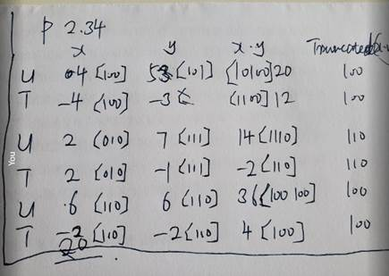

**Partise problem 1.1** 

A.  T(new) = 20h 

It is 1.2x

**Practice 2.29**

 

#### P2.34

#### P2.35

I don’t understand problem 2.35 and find the solution later.

#### P2.37

Aside  Security vulnerability in the XDR library  (after Practice problem 2.36, on Page 91)

$(2^{20}+1)*2^{12}= 2^{20}*2^{12} + 1*2^{12}=4,294,967,296 + 4,096$

Because $2^{20}$ is less than $2^{32}$(int: 4 bytes).

#### P2.38

LEA instruction: $a<<k+b$ . LEA is abbreviated to "Load Effective Address".

As we know from the question,  $k \in {0,1,2,3}$ and `b` is 0 or `a`.

1. When b is 0, the computation is simply $a<<k$, which gives: 

   - For k = 0 : a << 0 = a

   - For k = 1 : a << 1= 2a

   - For k = 2 : a << 2 = 4a

   - For k = 3 : a << 3 = 8a

     Thus, when b=0b = 0b=0, we can compute the multiples: 1a,2a,4a,8a

2. When b is a, the computation becomes $a<<k+a$, which gives:

   - k = 0 : a << 0 + a = 2a
   - k = 1 : a << 1 + a = 3a
   - k = 2 : a<< 2 + a = 5a
   - k = 3 : a << 3 + a = 9a

​         Thus, when b=ab = ab=a, we can compute the multiples: 2a,3a,5a,9a.

​      In conclusion, the answer is `1a, 2a, 3a, 4a, 5a, 8a, 9a`.

 

