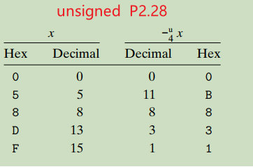

### Website

[CS 15-213](https://www.cs.cmu.edu/~213/index.html)

**Textbook** :  Computer Systems: A Programmer's Perspective, 3/E 

### Tips

[Tips on learning CS 15-213](https://csdiy.wiki/en/%E8%AE%A1%E7%AE%97%E6%9C%BA%E7%B3%BB%E7%BB%9F%E5%9F%BA%E7%A1%80/CSAPP/#descriptions)

```txt
If you have trouble with Chapter 7 Linking, I recommend reading the book Programmer's Self-Cultivation, subtitled link. load and library. This book can complete our understanding of program linking, and I believe after reading this book you will have a deeper comprehension of program linking, ELF files, and dynamic libraries. It is highly recommended to be read as a supplementary material after reading CSAPP and having a certain understanding of computer systems.
```

### Chapter 1. Tour of Computer Systems

#### 0, Programs are translated by other programs into different forms


gcc commands

```shell
# commands
# 1, hello.i
gcc -E hello.c -o hello.i / cpp hello.c -o hello.i # preprocessing 

# 2, hello.s
gcc -S hello.i  # translated into hello.s which is a assembly programme
# Or
gcc -S hello.c # skip the preprocess

# 3, hello.o
gcc -c hello.s -o hello.o  # relocatable object programs
# Or
as hello.s -o hello.o
# Or
gcc -c hello.c -o hello.o  # skip some steps

# 4, hello  
gcc hello.o -o hello # executable object program
```

#### 1, Shifting bits

In the low level of the computer system shifting bits is quite faster than arithmetic such as multiplication. If the former costs one clock cycle, the latter will normally costs from 13 to 17 clock cycles.  Nowadays the speed of multiplication has  increased dramatically but it still costs 4 clock cycles. While 4 is bigger than one anyway.

- What will happen if shifting 8 bits for a byte ?

  The result is zero no matter whether it is right shifting or left shifting. See `shifting-bits.c` in my C code.

#### 2, Signed and Unsigned

1. What will happened when a signed number is calculated with an unsigned number?
   First of all, the signed number will cast to a unsigned number and then calculate with the unsigned number. 

#### 3, Truncate a number

Truncating a number is like a module operation.

```txt
# 4 bits overflow so the most significant number is truncated.
1 1101 : 27 --> 1101 (11)
  1101 : 11   #27 % 16 = 11
```


#### 4, Important Themes

Chapter 1.9

1.9.1 Amdahl's Law
$$
S = \frac{1}{(1-a)+a/k}
$$
The processing speed of a system or an application won't be increased significantly if  only to improve the performance of a small part of the system. If we assumed that $k$ is infinite the result would be $S=\frac{1}{1-a}$. In other words, if a is small the S won't be too large.

#### 5, Process and thread

##### 1), Concurrency

In the abstract level of thread, for **traditional thread** concurrent execution is simulated.  Whereas, **hyperthreading**, sometime called "simultaneous multi-threading", is a technique that allows a singly core of the CPU to execute multiple flows of control.

#### 6, Summary

Chapter 1.10  Summary

1) A file is a sequence of bytes.

2) Storage devices that are in higher levels serves as caches for the devices in the lower levels. Programmers can optimize their C programmes by understanding and exploiting the memory hierarchy.

3) The operating system kernel serves as an intermediary between the application and the hardware. 

## Part I 

Programme Structure and Execution

### Binary bits and overflow

Computer representations use a limited number of bits to encode a number. For example, if we use 4 bits to represent number the maximum number is  $2^4 - 1 = 31$, and the operation to represent 32 can lead to overflow. 

```shell
# The default length of the number in gdb is 4 bytes which is 32 bits.
>gdb
>print 200*300*400*500  # output -884,901,888
```

#### Representing & Manipulating Sets

**1) Representation**

We use {0,1, ..., w-1} to represent the w-bit vector.

$a_j=1$ if $j\in {A}$

For example, `{0,3,5,6}`  represents `0110 1001`.

```txt
0110 1001
x65x 3xx0 
```

**2) Operation**

Mathematical terminologies for logic operations.

&: Intersection  (And)

|: Union (Or)

^: Symmetric difference (Exclusive or)

~: Complement (Flip)

There is early termination in the following operations.

`&&` , `||`. 

Note that `&&` and `||` are different from `&` and `|` in C, respectively.

#### 2.1.1 Hexadecimal Notation

When we say x is a power of 2, that is, $x=2^n$. We can also say that its binary representation is that 1 followed by $n$ zeros. For example, $8=2^3$ is  1000(binary). While a hexadecimal digit represents 4 digits in binary, namely 0 in hex mean 0000 in binary. So we can represent $2^{11} $ by a hexadecimal number which is `0X800`.  Because `0x8`=`0b1000` and `0x00`=`0b0000,0000`.

Tips:

Remembering binary representations of  three keys hexadecimal numbers could help you calculate representations of rest hexadecimals effectively.

A: 1010,   C: 1100,  F:1111

#### 2.1.2 Data Sizes

Every computer has a *word size* which indicates the nominal size of a pointer data. The size of any data type in computer is not limitless such as the sizes of an integer and long number are 4 and 8 bytes, respectively. 

As a programmer, we must be extremely cautious when are calculating numbers to prevent catastrophe which is caused by overflow. For example, in the 2's complement system the range of a char(1 byte)is from `-128~127`, if we add 100 to 50 the result is 150 which actually represents -106. 

#### 2.1.3 Addressing and Byte Ordering

Each byte has its own address in computer system. As programme files such as source file(\*.c), assembly file(\*.s), relocatable object file(\*.o) and executable file(\*.out) which all span multiple bytes, it is necessary for every byte having its address or it could be chaotic and the monolithic pillars may collapse.

Little endian and big endian.

**Little endian**: The least significant byte is stored in the place with the  smallest address and the most significant byte is stored in the place with the biggest address. The rest bytes are stored sequentially.

One important thing about little endian is when we are reading the machine-level program representations the least significant byte is on the left and the most significant is on the right and that is contrary to the normal way that we read numbers in real world. We should used to write the machine-level program from the right side to the left so that it is easy to read.

For example: 

```shell
40054b:	bf 04 06 40 00       	mov    $0x400604,%edi
```

Suppose that `40054b` is the address of an integer number(4 bytes), we should write the bytes conversely 
like `40 06 04 bf ` so that we can read it like what we do in math class.

**Big endian**: It is the opposite of little endian.

Note: See "[Analysis of Storage]("..\C-Code\26_AssemblyLanguage_And_Storage\Analysis of Storage.md")" for more about address, little endian and big endian.


#### Practice Problem 2.6

Why the hexadecimal presentation of  `3510593.0` is `0x4A1F23E0` in the 3rd edition of the book and is `0x4A564504` in 2nd edition? 

I also got the later result.  Why is that?

#### 2.1.6  Introduction to Boolean Algebra

There is a bit vector with indexes like $[a_{w-1}, a_{w-2}, ..., a_1, a_0]$.  For example,  a = [01101001]  encodes the set A = {0,3,5,6}. We should match the indexes from left to right such as 0 in $a_0$, 3 in $a_1$, 5 in $a_5$ and 6 in $a_6$, respectively.  \(P88\)

#### 2.1.7 Bit-Level Operations in C

#### 2.1.8 Logical Operation in C

`||, && and !` are logical operations. Don't confused them with bit-level operations-`|, &, ^, ~`.

The logical operations treat any nonzero argument as representing True and 0 as false. That means `!1 = 0 and !0b0101 = 0`.

```c
!0b0101 = 0; // false
!0 = 1; // true
0b0101 && 0b1001 = 1;
0b1010 && 0b0000 = 0;
```

#### 2.1.9 Shifting Operations in C

**1) What the differences between logical and arithmetic shift?**

We assumed that shifting *k* bits to the right like *a* >> *k*.

A logical shift fills the left end with k zeros. For example, `1100,0101 >> 2`  = `0011,0001`.

A arithmetic shift fills the left end with **k repetitions of the most significant bit**.  For example, 
 `1100,0101 >> 2`  = `1111,0001`  and `0101,1101 >> 2` = `0001,0111`. Note: not always filled with `1`.

**Note:** 

> The most significant bit is the bit which is at the very left of the whole bits of a number. For a short number such as `0x89c(actually is 0x089c)` (a short number is 2 bytes)  the most significant bit is '0' not '1'.

**2) What will happen if the shifting value is larger the the total bits of the number?**

In C standards the statement was carefully avoid. Normally, shifting such a large value is meaningless while for some other languages like Java the result equals k%w(k: shifting bits, w: the word's bits). 

For example, `1100 >> 6` means `1100 >> (6%4)`.

3) A trick  to get a bit pattern of the form [0,0,0,0,...1,1,1...1] which consists $w-k$ zeros and $k$ ones is to generate $(1<<k)-1$. For example, the expression $1<<8-1$  yields `0xFF`.

#### 2.2 Integer representations

##### 2.2.2 Unsigned Encodings

Explanation of a formula.
$$
B2U_w(\overset{\rightarrow}{x})=\sum_{i=0}^{w-1}x_i2^i
$$
From $w$ bits to unsigned numbers. The equation represents the convert from w-bit representation to a decimal. For instance, w=4, for `1011` the result is $1\times2^3+0\times2^2+1\times2^1+1\times2^0$.

$x$ represents the value of every single bit in different position.

$i=0$ : from 0

$w-1$:  2 to the power of from 0 to `w-1`.


**1) The "-2147483648" can't be printed directly in C.**

```c
// 22_Data_Type.c (C code)
/*
	 * Chapter 15.1 《Linux C 一站式编程》
	 * Althought the range of int is from -2147483648 to +2147483647，
	 * in x86 platform it is a combination of "-" and "2147483648" in the aspect of the compiler.
	 * Apparently, the 2147483648 is beyond the range of integer and it  the type of "long int".
	 * */
	// warning: format ‘%d’ expects argument of type ‘int’, 
	// but argument 2 has type ‘long int’ [-Wformat=]: 
	printf("%d\n", -2147483648);  
	
	// However, the following code is correct without any warnings.
	printf("%d\n", -2147483647 - 1);  
```

Note: The two's-complement is asymmetric- $|T_{min}|=|T_{max} + 1|$. That could lead to subtle program bugs.

**2) Conversions between signed and unsigned.  (Chapter 2.2.4)**

Casting a signed value to an unsigned value in C doesn't changed the bit representation. The effect of casting is to keep the bit values identical but change how these bits are interpreted, for instance, `1111, 1111` represents 255 as an unsigned number while it represents as -1 as a signed number.

**3) In C the signed value will be cast to unsigned when it is compared to an unsigned number**

```c
-1 < 0U // Because -1 = 2^8 > 0, the result is 0(false).
```

See my C code about unsigned and signed value. (29_Unsigned_and_Signed)

##### 2.2.6 Expanding the Bit Representation of a Number

(1) To convert an unsinged number to a larger data type we simply add leading zeros  to the representation.

```c
unsigned short us = 0x3c9f;
unsigned int ui = us;   // ui = 0x00003c9f
```

(2) Whereas, to convert an signed number to a larger data type we should add copies of the most significant bit to the leading representation.

```c
/*
* Signed
* =9, the length of short data type is 2 bytes. 
* The most significant bit of "sx" is 0, not 1 because we get the bit at 
* the head of 2 bytes. sx is a positive number.
*/
short sx = 0b0000,0000,0000,1010; 
int x = 0b0000...1010;
// If sx
short sx = 0b1000,0000,0000,1010;  // -10   
int x = 0b1111...1010;
```

See  my code:`CSAPP/code/code_examples/2.2.6_expanding_bits`

**4.1 Pay attention the order of conversion from a short data to a larger one.**

When converting short to unsigned, we first change the size from 2 bytes to 4 bytes so that the result is that 0xff added as the leading bits and then from signed to unsigned. Indeed this convention is required by C standards.

 **NOT:** if we first change the signed number to unsigned and then changed the size
the result would be 0x00c7cf and that doesn't comply with C standards.

See: ` CSAPP/code/code_examples/2.2.6_expanding_bits/order_of_expanding_bits .c`

**4.2 Negate a number** 

If you want to negate a number, no matter what it is a positive number or a negative one, a tricky way is to flip it and add 1. 
For example, for  a word such as $w_4$  contain 4 bits(-8 ~ 7),  if`a = 1010(-6)` then `~a=0101(5) and -a = ~a +1=0110(6)`.  This pattern is as same as what the author of "Code: The Hidden Language Behind..." has said but it is expressed in a different way. The author said that in basic level, to minus a number is actually by add the flipped value of its absolute value then truncate the overflowed bits.  Here is an example($w_4$):

```txt
5 - 2 = (5 + ~|-2|) - 16
      = (5 + 14) - 16
      = 3
```

##### 2.2.7 Truncating Numbers

For an unsigned number $x$, the result of truncating it to k bits is equivalent to computing $x$ mod $2^k$.

e.g. Truncating 4 bits to 3 bits: 

> 1001(9) ->001(1)  = 9 % $2^3$


**Elaboration of the solution:**

$w_4$ : (-8 ~ 7) ,  $w_3$ : (-4 ~ 3)

For signed number:

The result of -7(1001)  truncated by 1 bit  is 1(001). 

The result of signed   `1111(-1)  `($w_4$)after truncating 1 bits is `111` which is `-1` in $w_3$

##### 2.2.8 Advice on Signed vs. Unsigned

1. Elaboration of "  FreeBSD-SA-02:38.signed-error".   On page 77 of "CSAPP(2rd)".

```c
/*
 * Illustration of code vulnerability similar to that found in
 * FreeBSD’s implementation of getpeername()
 */

/* Declaration of library function memcpy */
void *memcpy(void *dest, void *src, size_t n);

/* Kernel memory region holding user-accessible data */
#define KSIZE 1024
char kbuf[KSIZE];

/* Copy at most maxlen bytes from kernel region to user buffer */
int copy_from_kernel(void *user_dest, int maxlen) {
	/* Byte count len is minimum of buffer size and maxlen */
	int len = KSIZE < maxlen ? KSIZE : maxlen;
	memcpy(user_dest, kbuf, len);
}
```

If a malicious programmer writes code to call `copy_from_kernel(...)` with a negative value of `maxlen`,  then the result of `KSIZE < maxlen` is false so that `len` is assigned with the value of `maxlen`. As we know, in          function `mecpy` the data type of the last argument is `size_t` which is unsigned, the negative number will become a large positive unsigned number and more private data of other user's will be copy from the memory. That is the security vulnerability. 

2. The minimum value of unsigned numbers is 0 so when $0-1$ the result is the maximum value.

   Which is $0-1->U_{max}$ 

#### 2.3 Integer Arithmetic

##### 2.3.1 Unsigned Addition

Since the size of a particular data type is finite, if that two non-negative numbers are added leads to the result which is beyond the maximum value, there is an overflow. The most significant bit will be truncated brutally. Unsigned arithmetic can be viewed as a form of modular arithmetic. For example,  $x+y=(x+y)\%2^w$(w is the word size).

See the C code in `26_AssemblyLanguage_And_Storage/6_BitField/bit_field_4_bits_test.c`. 

##### 2.3.2 Two's-Complement Addition

The two's-complement sum of two numbers has the exact same bit-level representation as unsigned sum. Which means same arrangement of bits represents different value in signed and unsigned numbers.  The overflowed bit will be truncated brutally.


**Note:** -8 + (-8) = -16, the real result is 0 after the most significant bit is truncated.

**Practice 2.32 (page 87 2nd edition)**

The range of two's complement is asymmetric by 0(-8~7 for 4 bits). The result is correct except when the `y` is `Tmin`. If y is -8 then -y is 8 so the addition overflows in the function `tdd_ok`.

```c
int tadd_ok(int x, int y) {
    int sum = x+y;
    int neg_over = x < 0 && y < 0 && sum >= 0;
    int pos_over = x >= 0 && y >= 0 && sum < 0;
    return !neg_over && !pos_over;
}

int tsub_ok(int x, int y) {
    return tadd_ok(x, -y);
}
```


##### 2.3.3 Two's-Complement Negation

1. The bit patterns for negation in two's-complement negation(取负数) is as same as that for unsigned negation.

   See practice 2.28 and 2.33




2. If you want negate a number of two's complement, you can do it only by flipping all the bits and adding 1 to the result. Namely `~x+1=-x`.

   For example, in 4-bit representation ($w=4,-8<x<7$ ), `0111(7)`'s negation is `1001(-7)(9U)`. The flipping bits of `0111(7)` is `1000` and `1000`+`1` is `1001(-7)`.

##### 2.3.4 Unsigned Multiplication

1.  $U<<k$ gives $U\times2^k$.
2. $U >>k$  gives $U\div2^k$.


##### 2.3.5 Two's complement multiplication

(1) We claim that the bit-level presentation of the product operation is identical for both unsigned multiplication and two's-complement multiplication.  Which means that the result is same in bit level,  the difference is as same as that between singed and unsinged value. 

For example, for four-bit unsigned and two's-complement multiplication  the lowest 4 bits of the both result is identical. 

| Mode \($w_4$\)   | x         | y         | x*y            |
| :--------------- | --------- | --------- | -------------- |
| two's complement | -1 [1111] | -4 [1100] | 4[0100]        |
| unsigned         | 15 [1111] | 12 [1100] | 180[1011 0100] |

We notice that the product of unsigned multiplication is also `0100` after truncating bits over than 4. 

##### 2.3.6 Multiplying by Constants


The integer multiply instructions is very slow, requiring 10 clock cycles whereas other integer operations such as addition, subtraction, bit-level operations, and shifting are required only 1 clock cycle.

So many C compilers will optimise code like `x*14` to `x<<3 + x<<2 + x<<1` recognising that $14=2^3+2^2+2^1$. It is also recognised as $14=2^4-2^1$. 

The following content is quoted from "CSAPP"

>  For example, 14 can be written as [(0 . . . 0)(111)(0)]. Consider a run of ones from
> bit position n down to bit position m (n ≥ m). (For the case of 14, we have n = 3
> and m = 1.) We can compute the effect of these bits on the product using either of
> two different forms:  
>
> Form A:  (x<<n) + (x<<n-1) + . . . + (x<<m)
>
> Form B:  (x<<n+1) - (x<<m)


#### 2.4 Floating Point 

#####   2.4.1 Fractional Binary Numbers  

1. The binary representation of $\frac{1}{10}$ is `0.0001 1001 1[0011]` in which the square brackets([]) means the repetition of specific bits. 

##### 2.4.2 IEEE Floating-Point Representation


The IEEE floating-point standard represents a number in a form $V=(-1)^s* M\times2^{E}$.

$E=e-bias$

**Case 1: Normalised Values**

1) Single precision(Float)

The bias is $bias = 2^{k-1} -1$, since $k$ is 8, the $bias$ is 127. Since $e$ is neither 0 nor 255, so $E$ is in range $-126\leq{e}\leq127$. (1-127=126,  254 - 127 = 127)

It is the same in double precision.

2) The significand in binary scientific representation is omitted, because in $M=1+f$ ,  M is represented by 1.$f_1,f_2,f_3...$. We can always adjust the exponent $E$ so that significand $M$ is in the range  $1\leq{M}<2$ . Therefore, the leading bit $1$ is not needed to be represented explicitly.

3) N.B.  $0.0$ can not be represented by any normalised value.

**Case 2: Denormalized Values**

When the exponent field is all zeros, so $2^0=1$ and $E=2^0-bias=1-bias$.

Two purposed of denormalized values:

1) To represent $0$. 

An attention that should be paid is that in IEEE standard $-0.0(s=1)$ and $+0.0(s=0)$ are considered different in some ways and same in others.

2) To represent numbers are very close to $0$.

#### 2.4.3 Example Numbers

Note: fields *s, exp* and *frac* are *1, k,* and *s* bits.

Figure 2.33  

Representative values for 6-bit floating-point format.

The bits of each part are:  s: $1$, exp: $k= 3$,  frac: $2$

Normalised Values:

Because the exponent  1~7, bias is $2^{k-1}=2{^3-1}=3$ , we can get $-1-3=-2, 7-3=4$ so $E$ is in range  $-2\leq{E}\leq4$.

For fraction part:  $1.f_1,f_2$. As aforementioned, since in IEEE regulation $1$ is not explicitly represented the maximum value of $f_1f_2$  is $0.2^{-1}2^{-2}$, namely $0.75$ which represents $1.75$. And $1.75$ x $4$ is $14$ when $s$ is 0 and is $-14$ when $s$ is $1$.


#### 3.8.5 Variable-Size Arrays

In C, the sizes of multidimensional arrays could be determined at compile time. 

For instance, in the following code all the sizes could be local variables or arguments. The parameter `n`must precede `A[n][n]` so that a compiler can know the dimension when it encounters the variable.

```c
int var_ele (int n, int A[n][n], int i, int j) {
    return A[i][j];
}
```

