### Website

[CS 15-213](https://www.cs.cmu.edu/~213/index.html)

My notes are written when reading the second edition of Computer Systems: A Programmer's Perspective.

### Tips

[Tips on learning CS 15-213](https://csdiy.wiki/en/%E8%AE%A1%E7%AE%97%E6%9C%BA%E7%B3%BB%E7%BB%9F%E5%9F%BA%E7%A1%80/CSAPP/#descriptions)

```txt
If you have trouble with Chapter 7 Linking, I recommend reading the book Programmer's Self-Cultivation, subtitled link. load and library. This book can complete our understanding of program linking, and I believe after reading this book you will have a deeper comprehension of program linking, ELF files, and dynamic libraries. It is highly recommended to be read as a supplementary material after reading CSAPP and having a certain understanding of computer systems.
```

### Chapter 1. Tour of Computer Systems

#### 0, Programs are translated by other programs into different forms

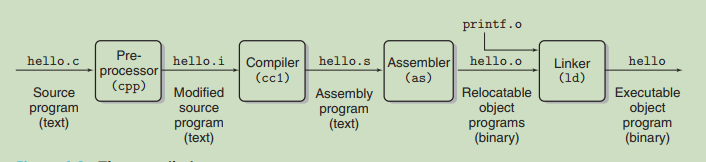

gcc commands

```shell
# commands
# 1, hello.i
gcc -E hello.c -o hello.i / cpp hello.c -o hello.i # preprocessing 

# 2, hello.s
gcc -S hello.i  # translated into hello.s which is a assembly programme
# Or
gcc -S hello.c # skip the preprocess

# 3, hello.o
gcc -c hello.s -o hello.o  # relocatable object programs
# Or
as hello.s -o hello.o
# Or
gcc -c hello.c -o hello.o  # skip some steps

# 4, hello  
gcc hello.o -o hello # executable object program
```

#### 1, Shifting bits

In the low level of the computer system shifting bits is quite faster than arithmetic such as multiplication. If the former costs one clock cycle, the latter will normally costs from 13 to 17 clock cycles.  Nowadays the speed of multiplication has  increased dramatically but it still costs 4 clock cycles. While 4 is bigger than one anyway.

- What will happen if shifting 8 bits for a byte ?

  The result is zero no matter whether it is right shifting or left shifting. See `shifting-bits.c` in my C code.

#### 2, Signed and Unsigned

1. What will happened when a signed number is calculated with an unsigned number?
   First of all, the signed number will cast to a unsigned number and then calculate with the unsigned number. 

#### 3, Truncate a number

Truncating a number is like a module operation.

```txt
# 4 bits overflow so the most significant number is truncated.
1 1101 : 27 --> 1101 (11)
  1101 : 11   #27 % 16 = 11
```


#### 4, Important Themes

Chapter 1.9

1.9.1 Amdahl's Law
$$
S = \frac{1}{(1-a)+a/k}
$$
The processing speed of a system or an application won't be increased significantly if  only to improve the performance of a small part of the system. If we assumed that $k$ is infinite the result would be $S=\frac{1}{1-a}$. In other words, if a is small the S won't be too large.

#### 5, Process and thread

##### 1), Concurrency

In the abstract level of thread, for **traditional thread** concurrent execution is simulated.  Whereas, **hyperthreading**, sometime called "simultaneous multi-threading", is a technique that allows a singly core of the CPU to execute multiple flows of control.

#### 6, Summary

Chapter 1.10  Summary

1) A file is a sequence of bytes.

2) Storage devices that are in higher levels serves as caches for the devices in the lower levels. Programmers can optimize their C programmes by understanding and exploiting the memory hierarchy.

3) The operating system kernel serves as an intermediary between the application and the hardware. 

## Part I 

Programme Structure and Execution

### Binary bits and overflow

Computer representations use a limited number of bits to encode a number. For example, if we use 4 bits to represent number the maximum number is  $2^4 - 1 = 31$, and the operation to represent 32 can lead to overflow. 

```shell
# The default length of the number in gdb is 4 bytes which is 32 bits.
>gdb
>print 200*300*400*500  # output -884,901,888
```

### 2. Representing & Manipulating Information

**1) Representation**

We use {0,1, ..., w-1} to represent the w-bit vector.

$a_j=1$ if $j\in {A}$

For example, `{0,3,5,6}`  represents `0110 1001`.

```txt
0110 1001
x65x 3xx0 
```

**2) Operation**

Mathematical terminologies for logic operations.

&: Intersection  (And)

|: Union (Or)

^: Symmetric difference (Exclusive or)

~: Complement (Flip)

There is early termination in the following operations.

`&&` , `||`. 

Note that `&&` and `||` are different from `&` and `|` in C, respectively.

#### 2.1 Information Storage

##### 2.1.1 Hexadecimal Notation

When we say x is a power of 2, that is, $x=2^n$. We can also say that its binary representation is that 1 followed by $n$ zeros. For example, $8=2^3$ is  1000(binary). While a hexadecimal digit represents 4 digits in binary, namely 0 in hex mean 0000 in binary. So we can represent $2^{11} $ by a hexadecimal number which is `0X800`.  Because `0x8`=`0b1000` and `0x00`=`0b0000,0000`.

Tips:

Remembering binary representations of  three keys hexadecimal numbers could help you calculate representations of rest hexadecimals effectively.

A: 1010,   C: 1100,  F:1111

##### 2.1.2 Data Sizes

Every computer has a *word size* which indicates the nominal size of a pointer data. The size of any data type in computer is not limitless such as the sizes of an integer and long number are 4 and 8 bytes, respectively. 

As a programmer, we must be extremely cautious when are calculating numbers to prevent catastrophe which is caused by overflow. For example, in the 2's complement system the range of a char(1 byte)is from `-128~127`, if we add 100 to 50 the result is 150 which actually represents -106. 

##### 2.1.4 Addressing and Byte Ordering

Each byte has its own address in computer system. As programme files such as source file(\*.c), assembly file(\*.s), relocatable object file(\*.o) and executable file(\*.out) which all span multiple bytes, it is necessary for every byte having its address or it could be chaotic and the monolithic pillars may collapse.

Little endian and big endian.

**Little endian**: The least significant byte is stored in the place with the  smallest address and the most significant byte is stored in the place with the biggest address. The rest bytes are stored sequentially.

One important thing about little endian is when we are reading the machine-level program representations the least significant byte is on the left and the most significant is on the right and that is contrary to the normal way that we read numbers in real world. We should used to write the machine-level program from the right side to the left so that it is easy to read.

For example: 

```shell
40054b:	bf 04 06 40 00       	mov    $0x400604,%edi
```

Suppose that `40054b` is the address of an integer number(4 bytes), we should write the bytes conversely 
like `40 06 04 bf ` so that we can read it like what we do in math class.

**Big endian**: It is the opposite of little endian.

Note: See "[Analysis of Storage]("..\C-Code\26_AssemblyLanguage_And_Storage\Analysis of Storage.md")" for more about address, little endian and big endian.

**N.B.** See `CSAPP/code/code_examples_in_the_book/chapter_2/` which verifies the "endian" of a machine with the help of a C programme.

##### 2.1.6  Introduction to Boolean Algebra

There is a bit vector with indexes like $[a_{w-1}, a_{w-2}, ..., a_1, a_0]$.  For example,  a = [01101001]  encodes the set A = {0,3,5,6}. We should match the indexes from left to right such as 0 in $a_0$, 3 in $a_1$, 5 in $a_5$ and 6 in $a_6$, respectively.  \(P88\)

##### 2.1.7 Bit-Level Operations in C

##### 2.1.8 Logical Operation in C

`||, && and !` are logical operations. Don't confused them with bit-level operations-`|, &, ^, ~`.

The logical operations treat any nonzero argument as representing True and 0 as false. That means `!1 = 0 and !0b0101 = 0`.

```c
!0b0101 = 0; // false
!0 = 1; // true
0b0101 && 0b1001 = 1;
0b1010 && 0b0000 = 0;
```

##### 2.1.9 Shifting Operations in C

**1) What the differences between logical and arithmetic shift?**

We assumed that shifting *k* bits to the right like *a* >> *k*.

A logical shift fills the left end with k zeros. For example, `1100,0101 >> 2`  = `0011,0001`.

A arithmetic shift fills the left end with **k repetitions of the most significant bit**.  For example, 
 `1100,0101 >> 2`  = `1111,0001`  and `0101,1101 >> 2` = `0001,0111`. Note: not always filled with `1`.

**Note:** 

> The most significant bit is the bit which is at the very left of the whole bits of a number. For a short number such as `0x89c(actually is 0x089c)` (a short number is 2 bytes)  the most significant bit is '0' not '1'.

**2) What will happen if the shifting value is larger the the total bits of the number?**

In C standards the statement was carefully avoid. Normally, shifting such a large value is meaningless while for some other languages like Java the result equals k%w(k: shifting bits, w: the word's bits). 

For example, `1100 >> 6` means `1100 >> (6%4)`.

3) A trick  to get a bit pattern of the form [0,0,0,0,...1,1,1...1] which consists $w-k$ zeros and $k$ ones is to generate $(1<<k)-1$. For example, the expression $1<<8-1$  yields `0xFF`.

#### 2.2 Integer representations

##### 2.2.2 Unsigned Encoding

Explanation of a formula.
$$
B2U_w(\overset{\rightarrow}{x})=\sum_{i=0}^{w-1}x_i2^i
$$
From $w$ bits to unsigned numbers. The equation represents the convert from w-bit representation to a decimal. For instance, w=4, for `1011` the result is $1\times2^3+0\times2^2+1\times2^1+1\times2^0$.

$x$ represents the value of every single bit in different position.

$i=0$ : from 0

$w-1$:  2 to the power of from 0 to `w-1`.


**1) The "-2147483648" can't be printed directly in C.**

```c
// 22_Data_Type.c (C code)
/*
	 * Chapter 15.1 《Linux C 一站式编程》
	 * Althought the range of int is from -2147483648 to +2147483647，
	 * in x86 platform it is a combination of "-" and "2147483648" in the aspect of the compiler.
	 * Apparently, the 2147483648 is beyond the range of integer and it  the type of "long int".
	 * */
	// warning: format ‘%d’ expects argument of type ‘int’, 
	// but argument 2 has type ‘long int’ [-Wformat=]: 
	printf("%d\n", -2147483648);  
	
	// However, the following code is correct without any warnings.
	printf("%d\n", -2147483647 - 1);  
```

Note: The two's-complement is asymmetric- $|T_{min}|=|T_{max} + 1|$. That could lead to subtle program bugs.

**2) Conversions between signed and unsigned.  (Chapter 2.2.4)**

Casting a signed value to an unsigned value in C doesn't changed the bit representation. The effect of casting is to keep the bit values identical but change how these bits are interpreted, for instance, `1111, 1111` represents 255 as an unsigned number while it represents as -1 as a signed number.

**3) In C the signed value will be cast to unsigned when it is compared to an unsigned number**

```c
-1 < 0U // Because -1 = 2^8 > 0, the result is 0(false).
```

See my C code about unsigned and signed value. (29_Unsigned_and_Signed)

##### 2.2.6 Expanding the Bit Representation of a Number

(1) To convert an unsigned number to a larger data type we simply add leading zeros  to the representation.

```c
unsigned short us = 0x3c9f;
unsigned int ui = us;   // ui = 0x00003c9f
```

(2) Whereas, to convert an signed number to a larger data type we should add copies of the most significant bit to the leading representation.

```c
/*
* Signed
* =9, the length of short data type is 2 bytes. 
* The most significant bit of "sx" is 0, not 1 because we get the bit at 
* the head of 2 bytes. sx is a positive number.
*/
short sx = 0b0000,0000,0000,1010; 
int x = 0b0000...1010;
// If sx
short sx = 0b1000,0000,0000,1010;  // -10   
int x = 0b1111...1010;
```

See  my code:`CSAPP/code/code_examples/2.2.6_expanding_bits`

**4.1 Pay attention the order of conversion from a short data to a larger one.**

When converting short to unsigned, we first change the size from 2 bytes to 4 bytes so that the result is that 0xff added as the leading bits and then from signed to unsigned. Indeed this convention is required by C standards.

 **NOT:** if we first change the signed number to unsigned and then changed the size
the result would be 0x00c7cf and that doesn't comply with C standards.

See: ` CSAPP/code/code_examples/2.2.6_expanding_bits/order_of_expanding_bits .c`

**4.2 Negate a number** 

If you want to negate a number, no matter what it is a positive number or a negative one, a tricky way is to flip it and add 1. 
For example, for  a word such as $w_4$  contain 4 bits(-8 ~ 7),  if`a = 1010(-6)` then `~a=0101(5) and -a = ~a +1=0110(6)`.  This pattern is as same as what the author of "Code: The Hidden Language Behind..." has said but it is expressed in a different way. The author said that in basic level, to minus a number is actually by add the flipped value of its absolute value then truncate the overflowed bits.  Here is an example($w_4$):

```txt
5 - 2 = (5 + ~|-2|) - 16
      = (5 + 14) - 16
      = 3
```

##### 2.2.7 Truncating Numbers

For an unsigned number $x$, the result of truncating it to k bits is equivalent to computing $x$ mod $2^k$.

e.g. Truncating 4 bits to 3 bits: 

> 1001(9) ->001(1)  = 9 % $2^3$

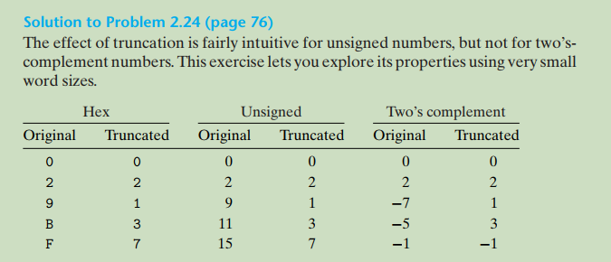

**Elaboration of the solution:**

$w_4$ : (-8 ~ 7) ,  $w_3$ : (-4 ~ 3)

For signed number:

The result of -7(1001)  truncated by 1 bit  is 1(001). 

The result of signed   `1111(-1)  `($w_4$)after truncating 1 bits is `111` which is `-1` in $w_3$

##### 2.2.8 Advice on Signed vs. Unsigned

1. Elaboration of "  FreeBSD-SA-02:38.signed-error".   On page 77 of "CSAPP(2rd)".

```c
/*
 * Illustration of code vulnerability similar to that found in
 * FreeBSD’s implementation of getpeername()
 */

/* Declaration of library function memcpy */
void *memcpy(void *dest, void *src, size_t n);

/* Kernel memory region holding user-accessible data */
#define KSIZE 1024
char kbuf[KSIZE];

/* Copy at most maxlen bytes from kernel region to user buffer */
int copy_from_kernel(void *user_dest, int maxlen) {
	/* Byte count len is minimum of buffer size and maxlen */
	int len = KSIZE < maxlen ? KSIZE : maxlen;
	memcpy(user_dest, kbuf, len);
}
```

If a malicious programmer writes code to call `copy_from_kernel(...)` with a negative value of `maxlen`,  then the result of `KSIZE < maxlen` is false so that `len` is assigned with the value of `maxlen`. As we know, in          function `mecpy` the data type of the last argument is `size_t` which is unsigned, the negative number will become a large positive unsigned number and more private data of other user's will be copy from the memory. That is the security vulnerability. 

2. The minimum value of unsigned numbers is 0 so when $0-1$ the result is the maximum value.

   So $0-1>=U_{max}$ 

#### 2.3 Integer Arithmetic

##### 2.3.1 Unsigned Addition

Since the size of a particular data type is finite, if that two non-negative numbers are added leads to the result which is beyond the maximum value, there is an overflow. The most significant bit will be truncated brutally. Unsigned arithmetic can be viewed as a form of modular arithmetic. For example,  $x+y=(x+y)\%2^w$(w is the word size).

See the C code in `26_AssemblyLanguage_And_Storage/6_BitField/bit_field_4_bits_test.c`. 

##### 2.3.2 Two's-Complement Addition

The two's-complement sum of two numbers has the exact same bit-level representation as unsigned sum. Which means same arrangement of bits represents different value in signed and unsigned numbers.  The overflowed bit will be truncated brutally.

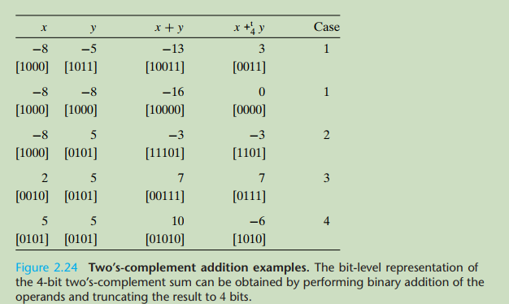

**Note:** -8 + (-8) = -16, the real result is 0 after the most significant bit is truncated.

**Practice 2.32 (page 87 2nd edition)**

The range of two's complement is asymmetric by 0(-8~7 for 4 bits). The result is correct except when the `y` is `Tmin`. If y is -8 then -y is 8 so the addition overflows in the function `tdd_ok`.

```c
int tadd_ok(int x, int y) {
    int sum = x+y;
    int neg_over = x < 0 && y < 0 && sum >= 0;
    int pos_over = x >= 0 && y >= 0 && sum < 0;
    return !neg_over && !pos_over;
}

int tsub_ok(int x, int y) {
    return tadd_ok(x, -y);
}
```


##### 2.3.3 Two's-Complement Negation

1. The bit patterns for negation in two's-complement negation(取负数) is as same as that for unsigned negation.

   See practice 2.28 and 2.33

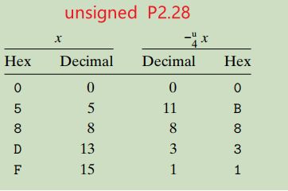

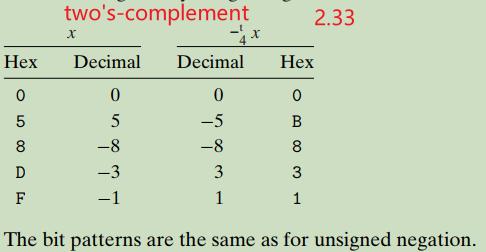

2. If you want negate a number of two's complement, you can do it only by flipping all the bits and adding 1 to the result. Namely `~x+1=-x`.

   For example, in 4-bit representation ($w=4,-8<x<7$ ), `0111(7)`'s negation is `1001(-7)(9U)`. The flipping bits of `0111(7)` is `1000` and `1000`+`1` is `1001(-7)`.

##### 2.3.4 Unsigned Multiplication

1.  $U<<k$ gives $U\times2^k$.
2. $U >>k$  gives $U\div2^k$.


##### 2.3.5 Two's complement multiplication

(1) We claim that the bit-level presentation of the product operation is identical for both unsigned multiplication and two's-complement multiplication.  Which means that the result is same in bit level,  the difference is as same as that between singed and unsinged value. 

For example, for four-bit unsigned and two's-complement multiplication  the lowest 4 bits of the both result is identical. 

| Mode \($w_4$\)   | x         | y         | x*y            |
| :--------------- | --------- | --------- | -------------- |
| two's complement | -1 [1111] | -4 [1100] | 4[0100]        |
| unsigned         | 15 [1111] | 12 [1100] | 180[1011 0100] |

We notice that the product of unsigned multiplication is also `0100` after truncating bits over than 4. 

##### 2.3.6 Multiplying by Constants

The integer multiply instructions is very slow, requiring 10 clock cycles whereas other integer operations such as addition, subtraction, bit-level operations, and shifting are required only 1 clock cycle.

So many C compilers will optimise code like `x*14` to `x<<3 + x<<2 + x<<1` recognising that $14=2^3+2^2+2^1$. It is also recognised as $14=2^4-2^1$. 

The following content is quoted from "CSAPP"

>  For example, 14 can be written as [(0 . . . 0)(111)(0)]. Consider a run of ones from
> bit position n down to bit position m (n ≥ m). (For the case of 14, we have n = 3
> and m = 1.) We can compute the effect of these bits on the product using either of
> two different forms:  
>
> Form A:  (x<<n) + (x<<n-1) + . . . + (x<<m)
>
> Form B:  (x<<n+1) - (x<<m)

##### 2.3.7 Extra

**Integer C puzzles** (It is shown at the end of Lecture 03 of the video course of CSAPP)

```c
int x = foo();
int y = bar();
unsigned ux = x;
unsigned uy = y;
```

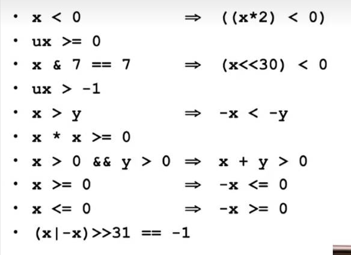

1) `x<0​` --> `((x*2) < 0)`.  

False. If $x$ is $T_{MAX}$, $x*2$ is $0$.

2) `ux >= 0`. 

True.

3) `x & 7 == 7` --> `(x << 30) < 0`.  

True. 7's binary representation is `0111` so the least significant three bits of `x` is `...111`.

4) `ux > -1`. 

False. When a signed value is being computed with an unsigned value, it will cast to an unsigned, while`-1`  has the same bit representation as the largest unsigned value. So it is a false statement. 

5) `x > y` ==> `-x < -y`.  

False. If `y` is $T_{min}$, `-y` is also $T{min}$. But `-x` could be a positive number. 

6) `x * x > 0`.  

False. If x is large enough, there might be an overflow so the result is a negative value. 

7) `x > 0 && y > 0` ==> `x + y > 0`.

False. There could be an overflow for the computation `x + y`. 

8)  If $x>=0$, then $-x<=0$.  True.

9)  If $x<=0$, then $-x>=0$.  

False. When $x$ is $T_{min}$ $-x$ is still a negative number. For instance, for a $w-bits$ binary number  if $w=4$, we assume that $x=-8(T_{min})$, then $-x$ is still $-8$ which is less than 0.

10) `(x | -x) >> 31 == -1`.

False. When `x` is 0, the statement is false.  

#### 2.4 Floating Point 

#####   2.4.1 Fractional Binary Numbers  

1. The binary representation of $\frac{1}{10}$ is `0.0001 1001 1[0011]` in which the square brackets([]) means the repetition of specific bits. 

##### 2.4.2 IEEE Floating-Point Representation

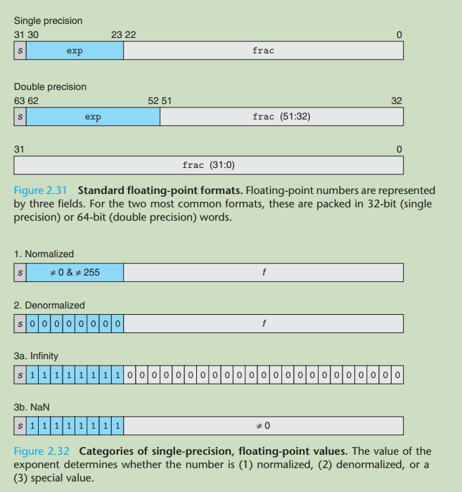

The IEEE floating-point standard represents a number in a form $V=(-1)^s* M\times2^{E}$.

$E=e-bias$($e$ is the exponent).

**Case 1: Normalised Values**

1) Single precision(Float)

The bias is $bias = 2^{k-1} -1$, since $k$ is 8, the $bias$ is 127. Since $e$ is neither 0 nor 255, so $E$ is in range $-126\leq{e}\leq127$. (1-127=-126,  254 - 127 = 127)

It is the same in double precision.

2) The significand in binary scientific representation is omitted, because in $M=1+f$ ,  M is represented by 1.$f_1,f_2,f_3...$. We can always adjust the exponent $E$ so that significand $M$ is in the range  $1\leq{M}<2$ . Therefore, the leading bit $1$ is not needed to be represented explicitly.

3) N.B.  $0.0$ can not be represented by any normalised value.

**Case 2: Denormalized Values**

Note that the $E$ is not $E=e-bias$ in normalised values, but  $E=1-bias$.

Why do we set the $E$ this way in denormalised values?

Because we can make a smooth transition between normal and denormal values. See Page 141.

**Two purposed** of denormalized values:

1) To represent $0$. 

An attention that should be paid is that in IEEE standard $-0.0(s=1)$ and $+0.0(s=0)$ are considered different in some ways and same in others.

2) To represent numbers are very close to $0$.

**Note** that there is no need to add an implicit `1` back to the fraction; denormalised values are always smaller than 1 since the exponent is all zeros. There is smooth transition from denormalised values to normalised ones. See Figure 2.34.

**N.B.** Denormalised values are always less than 1. Because there isn't any leading 1 before the `.`  in a significand and the fraction is always $\frac{1}{2}+\frac{1}{4}+\frac{1}{8}...$

**Case 3: Infinity & NaN**

NaN stands for "not a number".

##### 2.4.3 Example Numbers

**(1) An analysis of Figure 2.33.**

Note: fields *s, exp* and *frac* are *1, k,* and *s* bits.

Representative values for 6-bit floating-point format.

The bits of each part are:  s: $1$, exp: $k= 3$,  frac: $2$

**Normalised Values:**

Because the exponent  1~7, bias is $2^{k-1}=2{^3-1}=3$ , we can get $-1-3=-2, 7-3=4$ so $E$ is in range  $-2\leq{E}\leq4$.

For fraction part:  $1.f_1,f_2$. As aforementioned, since in IEEE regulation $1$ is not explicitly represented the maximum value of $f_1f_2$  is $0.2^{-1}2^{-2}$, namely $0.75$ which represents $1.75$. And $1.75$ x $4$ is $14$ when $s$ is 0 and is $-14$ when $s$ is $1$.

**(2) Floating-point representations and unsigned values(Page 143).**

How to convert simple integer values into floating-point form? See page 143.

**(3) The bit representation of a float $0.5$ .**

The following fragment of code is used to get the floating-point representation by take advantage of `union` in C.

```c
#include <stdio.h>
unsigned float_to_point(float f);
int main(void)
{
	unsigned u = float_to_point(0.5f);
	printf("%.2x\n", u);
	return 0;
}
unsigned float_to_point(float f)
{
	union {
		float f;
		unsigned u;
	} temp;
	temp.f = f;
	return temp.u;
}
```

The result is `0x3f 00 00 00`; its bit representation is `0011 1111 0000(6 times)` which can be rearranged as a floating point format `0(s) 0111 1110(exp) 0(23 0s, fraction)`. Apparently, it is a normalised value since the exponent is in the range of $1-255$. The bias is $127$ and `0111 1110` is $126$. Hence the $E=e-bias=126-127=-1$ and the fraction is $1.0$ after adding the implicit $1$. So we can get $V=(-1)^s\times 1.0\times 2^{-1}=0.5$. N.B. The fraction is $0$ NOT $2^{-1}$

### 3. Machine-Level Representation of Programmes

#### 3.4 Accessing Information

##### 3.4.2 Data Movement Instructions

- IA32 imposes the restriction that data from one place in memory could not be moved directly to another place in memory. Thus, moving data from memory to another place in memory typically needs two steps: move the data from memory to a register and then move the data from the register to memory.

- The behaviour of `pushl %ebp` is equivalent to that of the pair of instructions.

  ```assembly
  subl $4, %esp
  movl %ebp, (%esp)
  ```

  Similarly, the behaviour of `popl %eax` is equivalent to the following pair of instructions.

  ```assembly
  movl (%esp), %eax
  addl $4, %esp
  ```

  

#### 3.6 Control

##### 3.6.1 Condition Codes

CF: Carry Flag. It is used to detect overflow for unsigned operations.

For example, when we use `addl` instruction to perform the equivalent of the C code `int t = a + b;`, CF will be set to the result a Boolean expression: `(unsigned) t < (unsigned)a`, which is 1 when it is true and that indicates Unsigned overflow. If overflow doesn't happen, the result of `(unsigned) t < (unsigned)a` is CF=0 indicating no Unsigned overflow.  It is the same with condition codes.

##### 3.6.6 Conditional Move Instructions

(1) `cmovl`  will move data if a specific condition holds. Note that `l`is short for `less` not `long word`.

(2) Why does the code based on "conditional data transfer" can outperform the code based on "conditional control transfers"?

See Figure 3.16 and its illustration. 

The reason is modern processors achieve high performance through pipelining. See the assembly code in Figure 3.16(c), the compiler generates all the possible outcomes of a conditional branch. The processor achieves high performance by overlapping the steps of successive instructions. As can be in the assembly in Figure 3.16(c), the every stage of a pipeline processor is full of instructions, it doesn't have to always  to predict. If a processor doesn't predict correctly, there will be serious penalty and, presumably, much clock cycles are wasted. 

(3) Why the the assembly code is invalid implementation of `cread(...)`(Page 245)?

```c
int cread(int *xp) {
    return xp ? *xp : 0;
}
```

```assembly
# Invalid implementation of function cread
# xp is in register %edx
movl $0, %eax   # Set 0 as the return value.
testl %edx, %edx  # Test xp: xp & xp
# The following code is executed at any time since there isn't any `jump` instruction
# before it. When the address in %edx is 0, it is a null pointer causing a deferencing
# error. Thus, it is invalid.
cmove (%edx), %eax
```


#### 3.7 Procedures 

##### 3.7.2 Transferring Control

1,  The following instructions support procedure calls and returns. (Page 255)

(1) `call Label` or `call *Operand`

"Label" is usually a name of a function in assembly code. For example, `call sum`

There are two steps after the `call` is executed. First, it push the return address onto the top of stack; second, it jumps to the address of the called function. N.B. the return address is the address of the instruction immediately following the `call`.  See page 255. 

See the sequence of stages of `call` and `ret` in page 406 and Practice Problem 4.16 to know more details of these instructions. 

(2) `ret` 

There is not any arguments/operands in this instruction. 

The `ret` instruction also includes two operations:

1. First of all, the machine instructs `pop` to get the value on the top of the current stack, which is the address of an instruction following the called function in the caller's function.

2. Then jump to this address. 

(3) `leave` 

There is not any arguments in this instruction, either.

The `leave` is equivalent to the following two instructions:

```assembly
# %ebp now points the the bottom of currentstack, namely the called fuction.
# This instruciton is to set the stack pointer %esp to the bottom of the current stack
movl %ebp,%esp
# "popl" always move the top value of the stack. %esp points to the top all the time.
# Because %esp is at the bottom now, "popl %ebp" will move the value "old %ebp" 
# which is %ebp of caller's to the register %ebp. The aim is to restore the stack pointer 
# to the caller's statck.
popl %ebp
```


#### 3.8 Array Allocation and Access

##### 3.8.5 Variable-Size Arrays

In C, the sizes of multidimensional arrays could be determined at compile time. 

For instance, in the following code all the sizes could be local variables or arguments. The parameter `n`must precede `A[n][n]` so that a compiler can know the dimension when it encounters the variable.

```c
int var_ele (int n, int A[n][n], int i, int j) {
    return A[i][j];
}
```

#### 3.9 Heterogeneous Data Structures

##### 3.9.1 Structures

Note that `rp` is a pointer in `rp->height`.

```c
// 'rp' is a pointer here not a variable of struct. NOT "struct rect rp". 
struct rect *rp;  
```

In C a structure is similar to an array and all the components in it are store in a contiguous region of memory. A pointer of structure is the address of its first byte.

##### 3.9.2 Unions

1. Half of the bytes in each **leaf node** are wasted in the following implementation of a binary tree.

   ```c
   struct NODE_S {
     struct NODE_S *left; 
     struct NODE_S *right;
     double data;
   };
   ```


##### 3.9.3 Data Alignment

In Linux, the address of a `short` must be a multiple of 2; consequently, the least significant bit of the address is `0`. Because in a binary number, the second bit is equivalent to a decimal $2$ ; therefore, the least significant `1`, which equals a decimal 1, is zero.  The value in each position of a binary number is $8,4,2,1$.

#### 3.10 Putting It Together: Understanding Pointers

1) Casting one type of a pointer to another only changes its type but not its value.

2) Casting has higher precedence than arithmetic operations. For instance, 

``` c
char *p
// It computes 'p+28(7*4)' because it is cast to integer pointer at first.
(int *) p+7;

// However, the followning code computes 'p+7' because parentheses has increased the
// precedence of add in 'p+7'.
(int *) (p+7);
```

3) Pointers can also point to functions. 

The value of a function pointer is the address of the first instruction in the machine code which represents the function. 

```c
// Here is the prototype of a function named 'fun'.
int fun(int x, int *p);
// Declare a function pointer and assign a address of a function to it.
// The last parentheses indicate the two arguments of this function/
// The first "int" is the return type while the parentheses of it is not necessary.
// But (*fp) must be bracketed, otherwise it will be 'int * fp(int, int *)' which is a
// prototype of another function with "int *" pointer as its return value and "fp" as its
// name.
(int) (*fp)(int, int *);  
fp = fun;
int y = 1;
int result = fp(3, &y);
```

#### 3.11 Life in the Real World: Using the GDB Debugger

```shell
disas # Disassemble current function
```

#### 3.12 Out-of-Bounds Memory References and Buffer Overflow

1) An explanation of the code.

```c
// This is a function named 'gets' returning a char pointer.
char *gets(char *s){}
```

2) The addresses of the elements in an array ascend its indices / indexes. Namely, the bigger an index is, the higher the address is. So in page 292 the `%edx, %ebp...` are corrupted sequentially. 

But in the assembly in Page 291, compiler computes `buf` by `-12(%ebp)` in line 6. Why is it `-12(%ebp)` in `leal -12(%ebp), %ebx`? See my analyses. N.B. there are 4 bytes in each row in a stack.

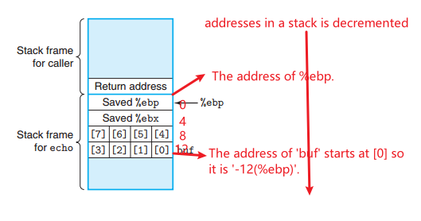

##### 3.12.1 Thwarting Buffer Overflow Attacks

Why can it be cracked by enumerating $2^{15}=32,768$ starting address for the randomisation over *n*=$2^{23}$ if we set up a 256 bytes nop sled? (Page 296)

I find the following equation, $256=2^8$ and $2^{23}-2^{15}=2^8$, but I still can't understand that statement. 


#### 3.13 x86-64: Extending IA32 to 64 bits

##### 3.13.3 Accessing Information

(1) An explanation of two sentences in Page 310.

*"Perhaps unexpectedly, instructions that move or generate 32-bits register values also set the upper 32 bits of the register to zero. Consequently, there is no need for an instruction `movzlq`".*

> Instructions of 32 bits in Figure 3.4 like `movl` set the upper 32 bits of the 64 bits in x86-64 to zero by default. `movl` and other 32-bit instructions could be used with operands of 64-bit value; they just ignore the upper 32 bits and set them to zero in the registers. Subsequently, we can use `movl` as an alternative instruction of `movzlq` . 

(2) **N.B**. There is only one operand in `imulq` and `mulq` since they have a implicit operand, `%rax`. The result of multiplication will be stored in the second operand, `%rax`, by convention.

For an instance, `mulq %rdx` generates the result of `%rdx` * `%rax`. See page 313.


### 4. Processor Architecture

#### 4.1 The Y86 Instruction Set Architecture

**What is "fetch stage"?**

In a pipeline processor, the execution of an instruction is divided into several stages, which includes fetching, decoding, executing, memory access and writing back results.

"Fetch stage" is the first stage of this pipeline, during which the processor retrieves (or fetch) the next instruction to be executed from memory. The address of this instruction is typically stored in Program Counter (namely PC).

##### 4.1.1 Programmer-Visible State

In IA 32 and Y86, instructions of conditional moves is executed implicitly. As an illustration, `cmovle %eax, %ebx` computes `%ebx - %eax`; it is not like `subl %eax, %ebx` that we can read. The computation of `cmovle`  is done in ALU automatically and Conditional Codes(CC) are updated simultaneously.  Consequently, in this problem, we can retrieve the value after any conditional moves. 

##### 4.1.4  Y86 Programs

What is the "array" used for in Figure 4.7 ?

It is the total volume of a program, including stacks and instructions. (That was concluded by me and has not been verified.)

##### 4.1.6 Some Y86 Instruction Details

**(1) Webaside ASM:ESAM**  

> To solve Practice Problem 4.6  we should know how to embedded assembly code into C code.

**(1.1)** Why is `setae` used to replace the original assemble code in page 4 of this web-aside?

The reason is that the function `tmult_ok_asm(...)` should return 1 when it didn't overflow, but `CF=0` indicates that there is no overflow. We should flip it it match our return value 1. Thus,  we use`setae`  to set `~CF` to a register while `CF`= 0 indicates there is no overflow. 

```assembly
# Hand-generated code for tmult_ok
	.globl tmult_ok_asm
# int tmult_ok_asm(long x, int y, long *dest);
# x in %rdi, y in %rsi, dest in %rdx
	tmult_ok_asm:
	imulq %rdi, %rsi
	movq %rsi, (%rdx)
# Deleted code
# testq %rsi, %rsi
# setg %al
# Inserted code
	setae %al # Set low-order byte
# End of inserted code
	movzbl %al, %eax
	ret
```

**(1.2)** One efficient way to write assembly manually is to modify the assembly code generated by gcc.

**(1.3) Extended Form of `asm`**

`=r`  : update register  (Output)

`r`: read register  (Input)

**(1.3.1) Elaboration of the inline assembly code in the above C code `tmult_ok2(...)`.**  

```c
int tmult_ok2(long x, long y, long *dest)
{
	int result;
    
	*dest = x*y;
	asm("setae %%bl # Set low-order byte\n\t"
        // Don't write '\n\t' at the end of the last line of assembly code strings.
        "movzbl %%bl,%[val] # Zero extend to be result"  // No '\n\t'.
        : [val] "=r" (result) /* Output */
        : /* No inputs */
        : "%bl" /* Overwrites */
	   );
	return result;
}
```

Notes: 

1. that all the lines of assembly code except for the last one should be ended with `\n\t` so that the generated assembly code follows the normal formatting conventions for assembly code. If there are comments, write '\n\t' after them.

2. There are two `%%`s in the assembly code strings when we are writing inline assembly code in C.

3. Don't use `%` in comments of assembly code. For instance, 

   ```c
   // The '%' in the comment is invalid and will cause an compiling error.
   asm("setae %%bl  # set %bl \n\t")  
   ```


(1)  `=r`  and an explanation of `setae %%bl`

```c
// ...
"movzbl %%bl,%[val] 
: [val] "=r" (result)
```

An assembler has assigned a register to the variable`result`, which is the return value; we don't know what the register it is but we want to replace it with the value in %bl. What shall we do? 

First of all, write `movzbl %%bl, %[val]` to move `%bl` to `%[val]` and then we update(`=r`) the register in which the `result` is stored by using `(result)`. 

Since in `tmult_ok20`, `result` is the return value, we now move the value of `~CF` to `%bl` by `setae %%bl`,  and move `%bl` to the register stored the return value, namely `result`. Finally, we manually retrieve the result of CF(carry flag to test unsigned overflow) and move it to `%bl` by writing assembly code in C implementing the function to test if `x*y` overflow or not. 

(2) `Overwrite`s in `: "%bl"  /* Overwrites */`

We have indicates that we have used `%bl` which is the low-order byte of `%ebx`, we should tell the assembler that we will overwrite it by `:%bl` in the last line. Since `%ebx` is a callee-saved register, the GCC assembler will take necessary steps to preserve it original value and restore it thereafter.

*Assembly code of `tmult_ok2` generated by GCC.*

```assembly
# int tmult_ok2(long x, long y, long *dest)
# x at %rdi, y at %rsi, dest at %rdx
	tmult_ok2:
	pushq %rbx # Save %rbx
	imulq %rsi, %rdi # Compute x * y
	movq %rdi, (%rdx) # Store at dest
# Code generated by asm
	setae %bl # Set low-order byte
	movzbl %bl,%eax # Zero extend %eax
# End of asm-generated code
	popq %rbx # Restore %rbx
	ret
```

**(1.3.2) `umult_ok(...)`**

```c
int umult_ok(unsigned long x, unsigned long y, unsigned long *dest)
{
	unsigned char bresult;

	asm("movq %[x],%%rax # Get x\n\t"
        "mulq %[y] # Unsigned long multiply by y\n\t"
        "movq %%rax,%[p] # Store low-order 8 bytes at dest\n\t"
        "setae %[b] # Set result"
        : [p] "=m" (*dest), [b] "=r" (bresult) /* Outputs */
        : [x] "r" (x), [y] "r" (y) /* Inputs */
        : "%rax", "%rdx" /* Overwrites */
	   );

	return (int) bresult;
}

```

The assembly code generated by GCC. 

```assembly
# int umult_ok(unsigned long x, unsigned long y, unsigned long *dest)
# x at %rdi, y at %rsi, dest at %rdx
1 # umult_ok:
2 movq %rdx, %rcx Save dest
# Code generated by asm
3 movq %rdi,%rax Get x
4 mulq %rsi # Unsigned long multiply by y;it equals 'mulq %rsi, %rax', '%rax' is implicit
5 movq %rax,(%rcx) # Store low-order 8 bytes at dest
6 setae %dil # Set low-order byte
# End of asm-generated code
7 movzbl %dil, %eax # Zero-extend result
8 ret
```

- `=m`

  ```c
  "movq %%rax,%[p] # Store low-order 8 bytes at dest\n\t"
  // ......
  : [p] "=m" (*dest), [b] "=r" (bresult)
  ```

  This instruction move quad words in `%rax` to `%[p]`; we tell the GCC assembler that we want to update the memory which is dereferenced by the value in a register in which `dest` is stored. See the line 5 in the assembly code above. 

- `r`

  ```c
  int umult_ok(unsigned long x, unsigned long y, unsigned long *dest)
  {
      // ...
      asm("movq %[x],%%rax # Get x\n\t"
          // ...
          : [x] "r" (x), [y] "r" (y) /* Inputs */
   }
  ```

  `r` instructs that to move the value of register in which `x` is stored into the register `%rax`. Input value to a register. 

In conclusion, we manage to populate data to registers for variables in the original C code to implement functions of assembly code by "Outputs", "Inputs" and "Overwrites". 

#### 4.2 Logic Design and the Hardware Control Language(HCL)

General Notes: 

1. Hardware Control Language(HDL) and Hardware Control Language(HCL)

   HDL can not necessarily be translated into HCL since they are not used to do so. Here is an analogy between HDL and HCL:

   Think of building a CPU like a car.

   HDL = engineering drawings of engine, gears, wiring

   HCL = rules for when to press brake or accelerator

   

##### 4.2.5 Memory and Clocking

**What is a register file?**

The register file is one type of random-access memory(RAM), but it is in a CPU. A processor can obtain the value in a register from the register file by register identifiers(which are addresses). In an IA32 or Y86 processor, there are 8 eight registers in the register file(%eax, %ecx, etc.).

*The following diagram shows a typical register file.* 

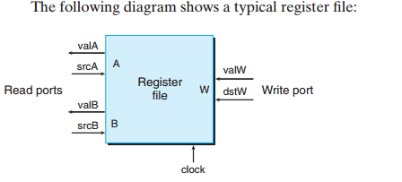

(1) A register identifier is set into `srcA` or `srcB`(See Figure 4.4 in page 374) so CPU(processor) knows which value of a register is to output. As an illustration, when `srcA` is set to 1(which represents `%ecx`), the register file will read the value in it and output the content in `%ecx` as `valA`. Typically, there are two operands in an instruction of machine-level programming language, such as `movl %ecx, %eax`, so there are two input register identifiers: `srcA` and `srcB`. An operating system instructs register files when an instruction is executed for the next instruction of a program. 

(2) It is the same with `dstW` and `valW`. CPU will access the register file with a register identifier in `dstW` and the value to write into this register in `valW`. To illustrate, when `subl $0x8, %esp` is executed, `dstW` is set to 4(represents `%esp`) and `valW` is set to `0x8`. Eventually, when the *clock* rises, the value in `%esp` will be updated.

(3) Attention should be paid is that writing and reading can happen simultaneously, when CPU is reading and writing the same register it can see slightly transition from the old value to the new one. 

**There is a random-access memory for storing program data.**

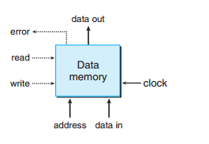

(1) When processor is reading from this "Data Memory", the clock is set to 0 and if the "address" is valid, after some delay, the value stored at the address will appear at "data out". If the "address" is invalid, the "error" signal will be set to 1. 

(2) Writing in "Data memory" is as same as operation in register files. First of all, the "clock" is set to 1 and the value at the "address" will be updated to that in "data in".

(3) "Data memory" is in so-called "memory", namely a piece of physical bar of memory.

#### 4.3 Sequential Y86 Implementations

##### 4.3.1 Organising Processing into Stages

**(1) Notes of 4.3.1**

- Y86 is a sequential processor called SEQ. 
- Note that each of the registers is represented by 4 bits, NOT 8 bits. So in `rA:rB`, either rA or rB has 4 bits.
- In `icode:ifun`, each of them also has 4 bits. See Figure 4.2 in page 372. 
- `valP` stores the address of next instruction. 

**(2) How is an instruction is executed in the machine level or how is an instruction is processed?**

There are a number of operations when processing an instruction and they are organised in a particular sequence of stages. Let's take line 3 in Figure 4.17  in page 399 as an example. See "Aside" in page 401.

```assembly
1 0x000: 30f209000000  	# irmovl $9, %edx
2 0x006: 30f315000000  	# irmovl $21, %ebx
3 0x00c: 6123  # subl %edx, %ebx
```

**Fetch:**  Before this stage, two constants, 9 and 21, have been moved to `%edx` and `%ebx`, respectively. In the fetch stage, a machine reads the bytes of an instruction from memory. Since Y86 is a sequential processor, it only reads one instruction from the address in the PC(program counter). In fact, one line of instruction with at most 6 bytes is read. Whereas, in our example, there are only 2 bytes which are `0x6123` (`icode:ifun` and `rA:rB`.) in 0x00c(memory address). `0x61` is `icode` while `0x23` is `ifun`; `2` is `rA`  and `3` is `rB`. `2` and `3` are register identifiers. 

Note that when reading `0x23` in `0x6132`, the PC will be incremented by 1 so that it can move to the next byte. A generic expression is $rA:rB \leftarrow M_1[PC+1]$.

$valP$ into which is stored the address of next instruction which is the result of current program counter add ed by 2: $PC+2$. 

**Decode:**  After this instruction is fetched, it is only a sequence of bits so that the machine should what it instructs. Thus, it will be decoded by refering to Figure 4.2, 4.3 and 4.4 (from Page 372). 

`0x61` indicates `subl`, so a combinational logic of subtraction of double words is prepared.

`0x23` represents `%edx` and `%ebx`, respectively. Thus, their value in the register file will be obtained.

**Execute:** Since all the instruction and the value of operands are all ready, the processor will use appropriate ALU to execute this instruction. Then it will set CC(Conditional Code).

$valE \leftarrow 21-9=12$

> **N.B.** 
>
> Instructions like `irmovl` and `rrmovl`  proceed like arithmetic operations. For `irmovl`, the first input of a ALU is an immediate value(a constant value denoted as valC) and the second is 0; they are computed as $valE \leftarrow 0 + valC$. 
>
> In the computation of `rrmovl`, for example, in `rrmovl %edx, %ebx` the processor don't need the fetch the value in the second operand(`%ebx`); it only fetch the value in the first operand(`%edx`) and set the second input of ALU to 0. Then ALU add 0 to the first operand(`%edx`).  The computation is $valE \leftarrow 0 + valA$. Finally, the value in `%edx` is moved to `%ebx`.

**Memory:** The memory stage may write data to memory. Whereas, in this example, it is needn't to do that since both of operands are registers.

**Write Back:** In the stage of write back, the results of "Execute" will write back to registers.

$R[\%ebx] \leftarrow valE=12$ 

**PC update:** Upte the program counter. Since there are two bytes in this instruction, so the program counter  is incremented by 2, which is `0x00e`

**(3) Explanation of Figure 4.19**

`rmmovl rA, D(rB)` instructs that value in a register rA to an address in memory referenced by `D(rB)`. 

In `D(rB)` D denotes displacement, which indicates that the address in `rB` should be displaced first and then move the value into the address. To illustrate, in `rmmovl %edx, 8(%esp)` `%edx` holds 12 and `%esp` holds `0x100`, 12 should be moved into `0x100+8=0x108`. Note that 8 is a decimal number. 

That's why in Execute stage valE $\leftarrow$ valB + valC;  valC is the displacement and valB is the value in rB so valE is the address to which valA is moved. 

In Figure 4.19, valC $\leftarrow$ $M_4[PC+2]$ indicates that to get the 4-byte value of displacement in the instruction whose address starts at [PC+2]. As an illustration, the 5th line in Figure 4.17 is `0x014: 404364000000  | rmmovl %esp, 100(%ebx)` in which `64000000` starts with [PC+2]; note that it is an little endian and should be read as `0x00 00 00 64`. 

**(4) Analyses of Figure 4.20 (`pushl` and `popl`)**

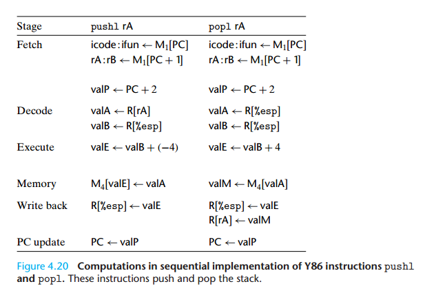

1. After reading the stages of Y86 instruction, we can now know why `pushl %esp`push the original value of `%esp` to its current stack. See practice problem 4.7 and 4.13.

2. The order of two instructions in Write back stage of `popl rA` shouldn't be changed. 

   > R[%esp] $\leftarrow$ valE
   >
   > R[rA] $\leftarrow$ valM

   As we test `pushl %esp` in Practice Problem 4.7, `popl %esp` will move `(%esp)` to `%esp`; in this stage, R[%esp]  $\leftarrow$ valE is executed first and is incremented by 4. Then, R[rA] $\leftarrow$ valM (R[%esp] $\leftarrow$ valM) indicates the incremented valued is overwritten by valM. 

   See practice problem 4.7 and 4.17. 

**(5) Three control transfer instructions: `jXX`, `call`, and `ret`**

Why does `valP`  equal PC+5 in `jXX Dest` in Figure 4.21?

The reason is there isn't any registers as operands in these `jXX Dest` instructions, so `icode:ifun` is one byte and the size of the address of destination is 4 bytes. Thus, there are 5 bytes in total. 

*Figure 4.21*

 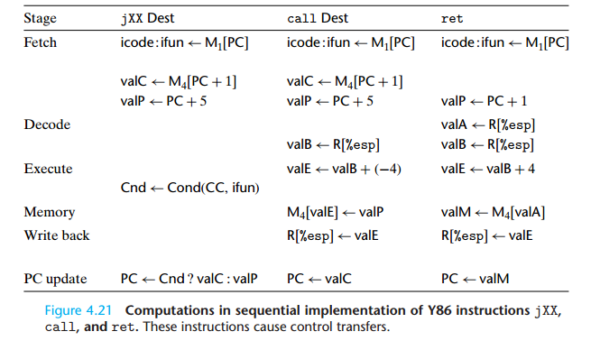

**(6) Sequence of stages of `call` and `ret`**

See Page 408. 

In the sequence of stages of `call Dest`, the address of the instruction which follows `call` is pushed onto the stack; the value of this address is valP $\leftarrow$ PC + 5. Then the address of `Dest` is set to PC so that `call` will skip to this address to execute instruction there. 


##### 4.3.2 SEQ Hardware Structure

(1) Condition code is updated by ALUs.

##### 4.3.3 SEQ Timing 

(1) How does hardware implement SEQ?

To implement SEQ, we make use of combinational logic  and two forms of memory devices: clocked registers (the program counter and the condition code register) and random access memories (RAM: including the register file, the instruction memory and the data memory.)

Combinational logic: 

Combinational logic consists of ALUs. Note that instruction memory is treated as part of combinational logic since it is only used to read instructions. 

The data memory is written only when an `rmmovl, pushl, or call` instruction is called since they all need  to access data memory.

(2) What does the "read back" mean in "The processor never needs to read back the state updated by an instruction in order to complete the processing of this in instruction" in page 414?

It means that the processor won't read a register again when process an instruction. As an illustration, to perform `pushl %edx` , the first step is to decrease `%esp` by 4 and then the second is to move the value in `%edx`  into the current stack in memory where `-4(%esp)` deference. Actually, in the second step processor doesn't read the updated value in `%esp`  but read `valE` instead(See Figure 4.20). `valE` can be treated as a temporary value under this circumstance. 

Why can't the processor "read back" the state in a register? 

Attention should be paid is that although an instruction is organised as 6 stages, they actually execute simultaneously. To illustrate, the processor can perform memory and register write at the same time in "Memory" and "Write  Back" stages, respectively. See Figure 4.20. If the processor read the updated value in `%esp` in the above example, it is prone to error when the `%esp` is updated by another instruction, perhaps. 

(3) State elements.

Program counter, condition code register, register file, and data memory are state elements.

(4) Elaboration of Figure 4.25 Tracing Two cycles of execution by SEQ.

State of program counter, condition code register, register file, and data memory are only updated when the next cycle begins. In other words, the updated values have been already generated at the "End of cycle 3", but they have NOT been moved into these state elements until the beginning of cycle 4. (Read the third paragraph in page 414 and the last two paragraphs in page 415.)

(5)  In a sequential processor architecture, how does a processor know that the combinational have finished and are ready to generate output when the clock rises, since different instructions such as arithmetic operation, Boolean, shift and so forth need various picoseconds? 

Answer One: 

> An answer from Google AI.
>
> In a synchronous sequential processor architecture, the processor relies on a carefully engineered design where the clock signal is used to determine when the outputs of the combinational logic are ready. The key mechanism that makes this work, despite varying instruction execution times, is the **worst-case timing analysis** [1]. 
>
> Here is how the system ensures correct operation:
>
> - **Fixed Clock Period:** The processor is designed with a fixed clock period that is long enough to accommodate the *slowest possible* operation among all the different instructions [1].
> - **Worst-Case Analysis:** During the design phase, engineers analyze every possible data path (arithmetic, boolean, shift, memory access, etc.) and identify the "critical path"—the path with the longest delay [1]. This delay, plus a safety margin (setup time), dictates the minimum clock period.
> - **Clock Edge Triggering:** A flip-flop (or register), a basic memory element in the processor, has an input (D) and an output (Q). When the clock signal transitions (typically on the rising edge), the flip-flop captures whatever value is present at its input at that exact moment and holds it until the next clock edge [1].
> - **Combinational Logic Completion:** The combinational logic (the actual circuits that perform operations like addition, shifting, etc.) is given the entire clock cycle to complete its task. Although some instructions might finish much faster than the allotted time, their results simply arrive at the input of the next stage of flip-flops early and wait there until the clock edge arrives to be captured [1].
> - **Safety Margin:** The clock period includes a safety margin to account for manufacturing variations, temperature changes, and other environmental factors, ensuring that even under non-ideal conditions, the slowest instruction will complete within the cycle [1]. 
>
> Essentially, the processor doesn't dynamically "know" when an operation has finished. Instead, the design guarantees that *all* operations will be finished and stable before the next clock edge arrives to read the result [1]. This strict timing discipline allows complex, multi-stage operations to be broken down into sequential steps that synchronise with the fixed rhythm of the clock. 

Answer Two:

Processor architects divide an instruction execution into a large number of  ridiculously simple steps so that they can decide the maximum time of each steps. Read the last paragraph in page 431 of CSAPP 2e. 

#### 4.4  General Principles of Pipelining

##### 4.4.1 Computational Pipelines

(1) Why is the throughput 8.13 GIPS? (Page 427)

The reason is when I1 is in stage C, I2 is in stage B and I3 is in stage A so that there are three different stages of one instruction are performed per 100 + 20 picoseconds. According to the equation of throughput in page 426, the result is 8.13 GIPS. 

Note that the denominator is the time of each stage(100+20), but not the total delay(360).

##### 4.4.3 Limitations of Pipelining 

**Nonuniform Partitioning** 

Notes of Figure 4.36

(1) "The sum of delays through all of the stages remains 300 ps. " 

> 300 = 50 + 150 + 100 

(2) Why is the delay 510 ps and the throughput is approximately 5.88 GIPS? 

The reason is that faster combinational logics, A and C, have to wait B (150 ps). Hence, the total delay is "(150 + 20) * 3 = 510". 

1/(150 + 20) * 1000/1 $\approx$ 5.88 GIPS .

**Diminishing Returns of Deep Pipeling**

1. Where does the "8.33" come from in page 431?

   See page 427. It is the throughput of the three-stage pipelined computatoin hardware.

2. Why does it say "In our new design, this delay consumes 28.6% of the total clock period"?

   Since we have doubled the stages from 3 to 6, the throughput is not as two times as that of three-stage pipeline. The reason is that we add extra pipeline registers; they are six in total, each of which consumes 20 picoseconds, therefore, they are (20*6) / 420 = 28.6% of the total period. 

##### 4.4.4 Pipelining A System with Feedback

1. Figure 4.38 demonstrates the danger if we introduce feedback to pipeling, because the updated value of Instruction 1 is used by Instruction 4. That wreaks havoc ! They are distinct instructions. 


#### 4.5 Pipelined Y86 Implementations 

##### 4.5.1 SEQ+: Rearranging the Computation Stages 

1. What difference between SEQ and SEQ+ in terms of PC(program counter) ?

   In SEQ, the value of PC is updated at the end of an clock cycle, namely at the last stages of an instruction. Note that the new value of PC has been already computed at the end of the cycle even though it has not been updated to the PC register, but it will be update at the beginning of next clock cycle. (See Figure 4.25).

   Whereas, in SEQ+, the computation of new PC is move to the next clock cycle(it then becomes the current one). Since we have the same data, such as conditional codes and icode, as in previous clock cycle, the combinational logic will generate the same output with them at the beginning of the current clock cycle. 

   Tips: 

   `pIcode` and `pCnd` are an acronyms for "previous icode" and "previous conditional code", respectively. 

##### 4.5.2 Inserting Pipeline Registers

Tips: 

1. Note that "register file" is the register file in the Decode stage, in which there are processor registers such as `%eax, %edx` and so forth and they will be updated at the end of every instruction; they are not pipeline registers. 
2. "rounded boxes" are different from "rounded rectangles". See the explanation of Figure 4.23. 

##### 4.5.3 Rearranging and Relabelling Signals 

1. In PIPE-, `dstE` and `dstM` are carried to the last pipeline register W so that the `valE` and `valM` won't be written to registers with the signals(also `dstE` and `dstM`) from other instructions. 

##### 4.5.4 Next PC Prediction

1. Conditional code is generated in "Execute Stage", so we will not whether or not the branch will be taken when an instruction is fetched in the "Fetch Stage" until several cycles later.
2. "*Branch prediction*" is nearly used by nearly all processors. 
3. Review 3.6.6, especially the penalty of misprediction. 


##### 4.5.5  Pipeline Hazards

1. Aside: Condition Code register

   Since condition codes are all written by integer operations in execute stage, they are used by conditional moves in execute stage and  conditional jumps in execute stage, therefore, condition codes have been definitely generated when the following instructions use them. There will be no hazards. 