### Practice problem 1.1

A.  T(new) = 20h 

It is 1.2x

## Chapter 2

### Practice Problem 2.6

Why the hexadecimal presentation of  `3510593.0` is `0x4A1F23E0` in the 3rd edition of the book and is `0x4A564504` in 2nd edition? 

I also got the later result.  Why is that? Perhaps the answer is wrong in the 3rd edition. 

### Practice Problem  2.29

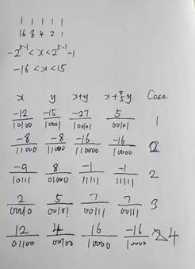

 

### Practice Problem 2.34

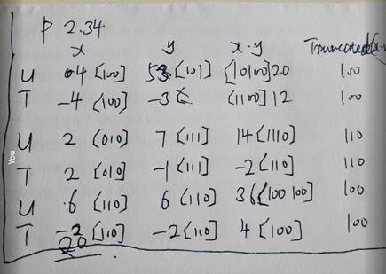

### Practice Problem 2.35

I don’t understand problem 2.35 and find the solution later.

### Practice Problem 2.37

Aside  Security vulnerability in the XDR library  (after Practice problem 2.36, on Page 91)

$(2^{20}+1)*2^{12}= 2^{20}*2^{12} + 1*2^{12}=4,294,967,296 + 4,096$

Because $2^{20}$ is less than $2^{32}$(int: 4 bytes).

### Practice Problem 2.38

LEA instruction: $a<<k+b$ . LEA is abbreviated to "Load Effective Address".

As we know from the question,  $k \in {0,1,2,3}$ and `b` is 0 or `a`.

1. When b is 0, the computation is simply $a<<k$, which gives: 

   - For k = 0 : a << 0 = a

   - For k = 1 : a << 1= 2a

   - For k = 2 : a << 2 = 4a

   - For k = 3 : a << 3 = 8a

     Thus, when b=0b = 0b=0, we can compute the multiples: 1a,2a,4a,8a

2. When b is a, the computation becomes $a<<k+a$, which gives:

   - k = 0 : a << 0 + a = 2a
   - k = 1 : a << 1 + a = 3a
   - k = 2 : a<< 2 + a = 5a
   - k = 3 : a << 3 + a = 9a

​         Thus, when b=ab = ab=a, we can compute the multiples: 2a,3a,5a,9a.

​      In conclusion, the answer is `1a, 2a, 3a, 4a, 5a, 8a, 9a`.

###  Practice Problem 2.43 

As 

### Practice Problem 2.44 

Actually, some parts of the solution are incomprehensible. I will figure it out later.

### Practice Problem 2.45

| Fractional Value | Binary Representation | Decimal Representation |
| ---------------- | --------------------- | ---------------------- |
| $\frac{1}{8}$    | 0.001                 | 0.125                  |
| $\frac{3}{4}$    | 0.11                  | 0.75                   |
| $\frac{25}{16}$  | 1.1001                | 1.5625                 |
| $2\frac{11}{16}$ | 10.1011               | 2.6875                 |
| $1\frac{1}{8}$   | 1.001                 | 1.125                  |
| $5\frac{7}{8}$   | 101.111               | 5.875                  |
| $3\frac{3}{16}$  | 11.0011               | 3.1875                 |

### Practice Problem 2.46

1. The binary representation of $\frac{1}{10}$ is `0.0001 1001 1[0011]` in which the square brackets([]) means the repetition of specific bits. 

2. Elaboration of the answers of C and D.
   The answer is approximately $0.343$ seconds, which indicates that the clock or something to count time of  the Patriot Missile is about $0.343$  slower than the real time.  If the speed of an Iraqi missile is 
   $2000km$, $2000*0.343$  is 686 which is quite a big number and is definitely has disastrous effects.

### Practice Problem 2.47 

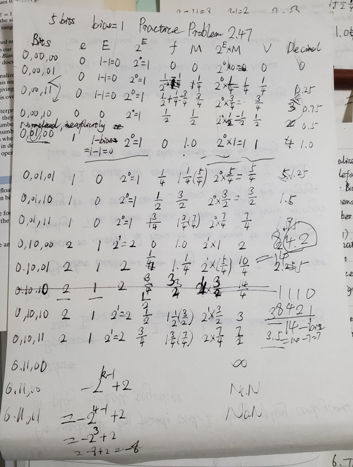

### Practice Problem 2.48

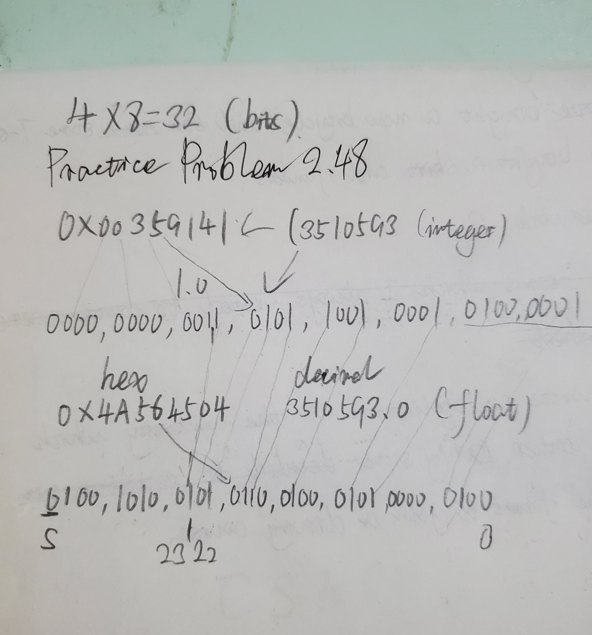


## Chapter 3

### Practice Problem 3.10

```txt
Practice Problem 3.10
It is common to find assembly code lines of the form
xorl %edx,%edx
in code that was generated from C where no Exclusive-Or operations were
present.
A. Explain the effect of this particular Exclusive-Or instruction and what
useful operation it implements.
B. What would be the more straightforward way to express this operation in
assembly code?
C. Compare the number of bytes to encode these two different implementations of the same operation.
```

Why does `xorl %edx, %edx` only needs two bytes?

Here is my conclusion from the answer below: The operations such as `xor`, `add`, `sal` and so forth are also encoded in the CPU of IA32. So are the registers. They all have address or numbers in CPU, too. One byte (255) is enough to represent them all.  

In order to verify the solution disassembling assembly code `xorl %edx, %edx` and `movl $0, %edx` is necessary. 
First of all, we write a assembly code named `p3.10_xor_mov_compare.s`.

```assembly
# Instructions are omitted before the operations.
_start:
xorl %edx, %edx
movl $0, %edx
```

Secondly, compile it and disassemble the object file.

```assembly
# as -s p3.10_xor_mov_compare.s -o test_3_10.o
# objdump -d test_3_10.o
=========== disassebling result
test_3_10.o:     file format elf64-x86-64


Disassembly of section .text:

0000000000000000 <_start>:
   0:   31 d2                   xor    %edx,%edx  # 2 bytes
   2:   ba 00 00 00 00          mov    $0x0,%edx  # 5 bytes ('00 00 00 00' is $0)
   7:   cd 80                   int    $0x80
# Both '31' and 'ba' are operating code of CPU to represent 'xor' and 'mov', respectively. They are all hexadecimal numbers.
```


*The following answer is from ChatGPT.*

The instruction `xorl %edx, %edx` is compact because it takes advantage of **register-to-register encoding** in x86 assembly, which is optimized to use minimal bytes for operations that only involve registers. Here's a breakdown of why it requires only two bytes:

**1. Instruction Encoding Overview**

In x86 assembly, instructions are encoded using:

- **Opcode**: Specifies the operation (e.g., `XOR`).
- **ModR/M Byte**: Indicates the registers involved in the operation.

The `xorl %edx, %edx` instruction works like this:

- **Opcode**: For XOR between two 32-bit registers, the opcode is **`0x31`**.

- ModR/M Byte

  : Specifies both source and destination registers: 

  - The ModR/M byte consists of: 
    - **Mod**: Specifies the addressing mode (here, both operands are registers, so `Mod=11`).
    - **Reg/Opcode**: Specifies the first register (`%edx` → `010`).
    - **R/M**: Specifies the second register (`%edx` → `010`).

When the source and destination registers are the same, this compact encoding allows the operation to be represented in **just two bytes**.

------

**2. Exact Encoding for `xorl %edx, %edx`**

- **Opcode**: `0x31` (indicates XOR for two 32-bit registers).

- ModR/M Byte

  : Encoded as 

  ```
  0xD2
  ```

  : 

  - **Mod**: `11` (register-to-register mode).
  - **Reg**: `010` (indicating `%edx`).
  - **R/M**: `010` (indicating `%edx`).

Thus, the entire instruction is:

```
31 D2
```

This is exactly **two bytes** long.

------

**3. Why Only Two Bytes?**

1. **Efficient Encoding**: The x86 instruction set uses compact encoding for operations that involve only registers. This avoids the need to include additional bytes for immediate values or memory addresses.
2. **Redundancy Optimization**: Since both operands are the same register, the ModR/M byte can fully specify the operation without needing extra data.

------

**Comparison with `movl $0, %edx`**

For `movl $0, %edx`, the instruction must include:

- The opcode (`0xC7`) for moving an immediate value.
- The ModR/M byte to indicate the destination register.
- A 4-byte immediate value (`0`).

This results in a **5-byte instruction**:

```
C7 C2 00 00 00 00
```

In contrast, `xorl %edx, %edx` avoids the need for the immediate value and uses the register encoding directly, saving 3 bytes.

------

**Key Takeaways**

- **Encoding Efficiency**: The compact encoding of `xorl %edx, %edx` results in only two bytes (`31 D2`).
- **Optimization**: This is why compilers favour such instructions to zero out registers—it minimizes memory usage and instruction size, improving performance in tight loops or embedded systems.

### Practice Problem 3.17

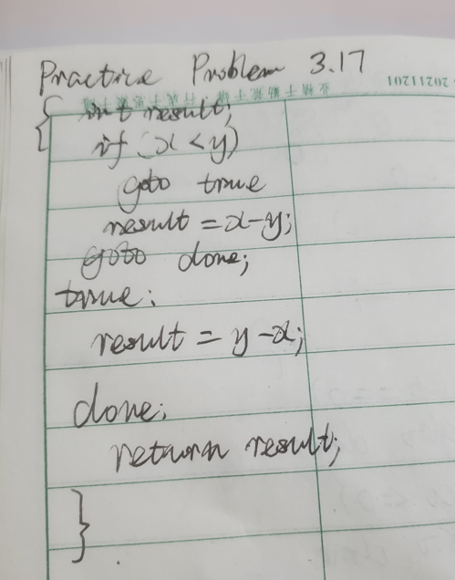

### Practice Problem 3.20

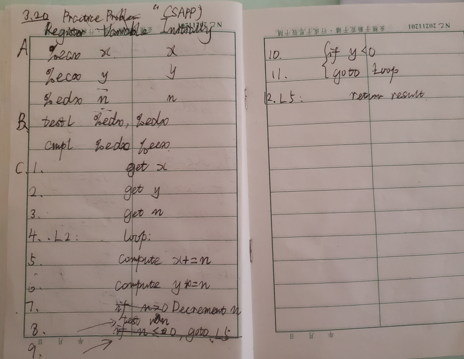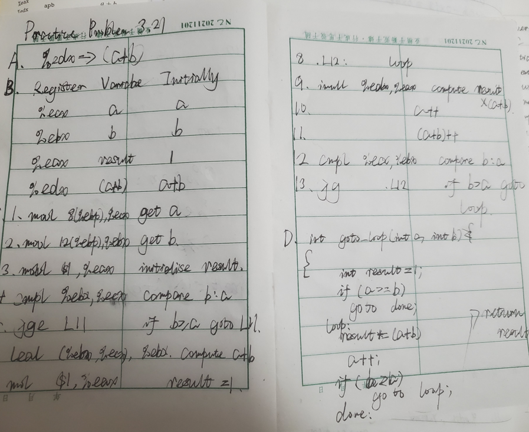

### Practice Problem 3.21


### Practice Problem 3.22

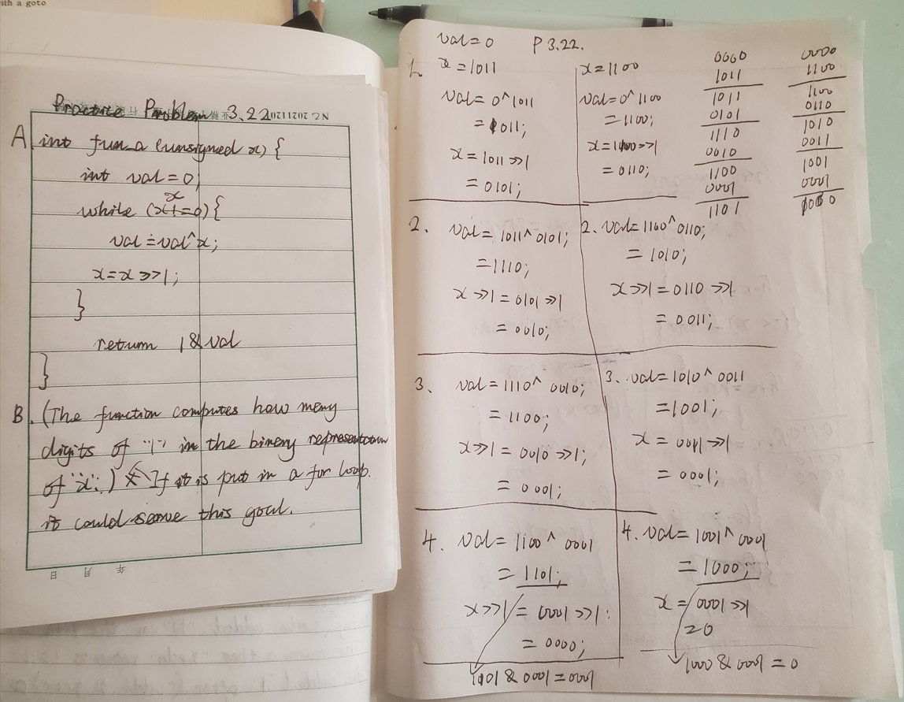

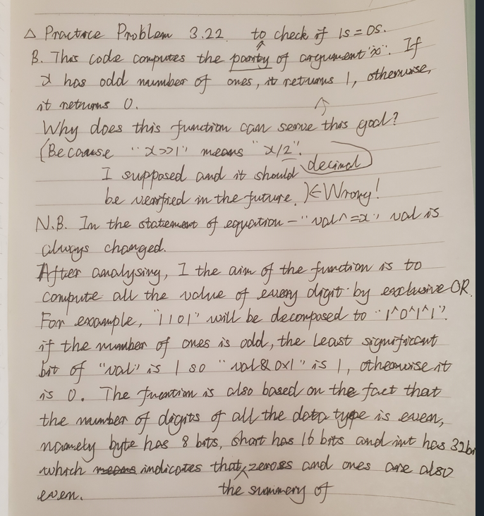

### Practice Problem 3.27

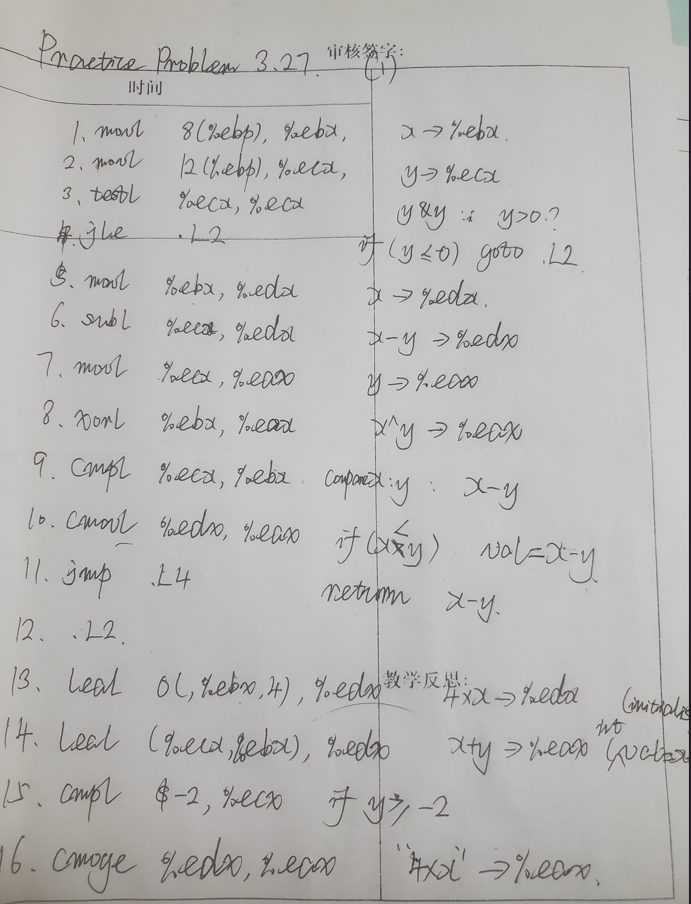

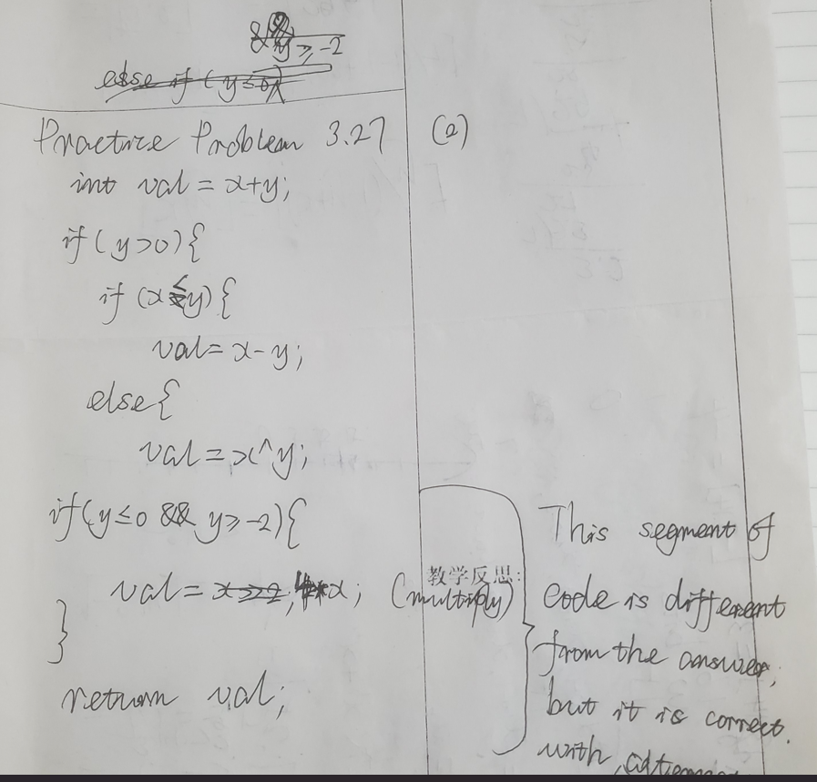

### Practice Problem 3.29

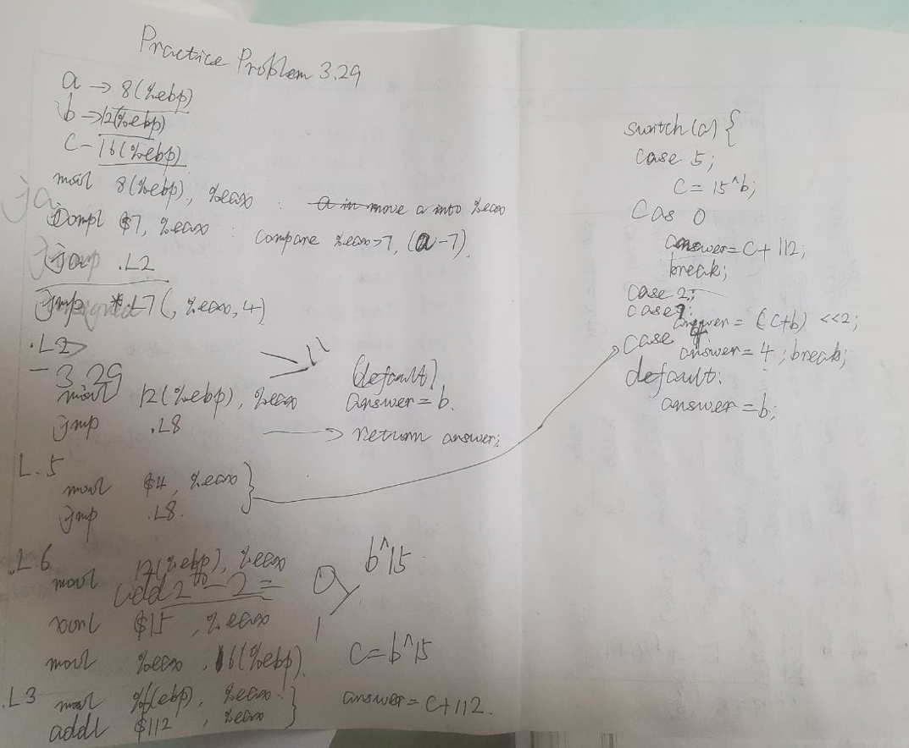

### Practice Problem 3.32

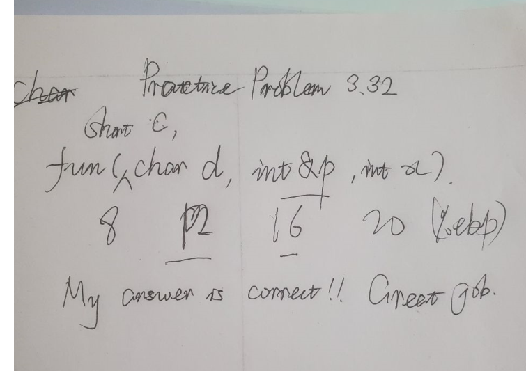

### Practice Problem 3.38

Page 272.

Notes:

> 1. "diagonal elements" are like `A[0][0],A[1][1]` and so forth. 
> 2. In this problem the number of both rows and columns is N and thus there are $N\times N$ elements in total.
> 3. The formula of computing diagonal elements is, for instance, `A[0][0] + (N+1) = A[1][1]`.

An elaboration of the assembly code.

```assembly
4 .L14
5 movl %edx, (%ecx, %eax)
# This instruction indicates that it moves "val" to the address in memory where 
# (%ecx,%eax) deferences. 
# A[0][0] = val or *ABase = val or (A + index) = val.
6 addl $68, %eax
# It scales an increment by the size of underlying data. Namely the size of an integer in 
# this example. The computation is "4*(N+1)=68".
7 cmpl $1088, %eax
# There are N*N elements in total; N*(N+1) beyonds the end of the last elements.
# 4*(N+1)*N=1088
```

An analysis of the solution of C code.

```c
void fix_set_diag_opt(fix_matrix A, int val) {
    // Move the value of the address of the place somewhere in memory where the pointer 
    // "ABase" references.
    int *Abase = &A[0][0];
    int index = 0;
    do {
        // 5 movl %edx, (%ecx, %eax). Move the "val" to the place where "Abase + index" 
        // references.
        Abase[index] = val;  
    }
}
```

### Practice Problem 3.39

```c
void sp_init(struct prob *sp)
{
    sp->s.x = sp->s.y;  // Note that it is 'sp->s.y' but not 's.y'.
    sp->p = &(sp->s.x); // NOT &(s.x) which is my wrong answer.
    sp->next = sp; // NOT '&(s.p)'. There isn't any 'p' in s.
}
```

### Practice Problem 3.40

| EXPR                                                         | TYPE    | Code                                                         |
| ------------------------------------------------------------ | ------- | ------------------------------------------------------------ |
|                                                              |         | `movw $ax, ($edx)`  <br /> # The register is `$ax` here.     |
| `&up->t1.d`<br /># It equals `&(up->t1.d)`, namely get the <br/> address of `up->t1.d`. | short * | `leal 2(%eax), $eax`<br /> `movl %eax, (%edx)`               |
| `up->t2.a`                                                   | int *   | `movl $eax, (%edx)`                                          |
| `up->t2.a[up->t1.s]`                                         | int     | `movl 4(%eax), %ecx`  <br /> # Get  data in `t1.s`.<br /> `movl (%eax, %ecx, 4), %eax`<br/> # Compute `t2.a[up->t1.s]` <br /> # And get the value of it<br /> `movl %eax, %ebx` |
| `*up->t2.p`<br /> # Get the object which the pointer references. | char    | `movl 8(%eax), %eax`<br /> `movb (%eax), %al`<br /> `movb %al, (%edx)` |

*I will review it later.* 

### Practice Problem 3.41

B.  `struct P2 (int i; char c; char d; int j;);`

```text
i 	c 	d	j   total	alignment
0	4	5	8  	12		4
```

They are 12 bytes in total because `c` and `d` are stored in adjacent spaces in memory and then followed by padding of 2 bytes. I thought it was 16 bytes. 

C. `struct P3 {short w[3]; char c[3];};`

```txt
w	c	total	alignment
0	6	10		2
```

There are 3 bytes in the char array `c` and then an extra byte added by compiler in order to respect the convention of alignment. 

D. `struct P4 {short w[3]; char *c[3]}`

N.B. `*c` is an array of pointer of char. Obviously, the size of any pointer is 4 bytes all the time in a Linux/IA32 machine.

```txt
w	c	total	alignment
0	8	20		4
```

Two bytes are added by compiler after `w` so that the size is 8 bytes in total which satisfies alignment requirement, namely the memory address is a multiple of 4 in this circumstance. 

### Practice Problem 3.42

Note that the code is compile on a Windows machine.

A. N.B. Small objects don't have to be aligned with the element with the largest size. If the size of an element is smaller than its preceded one in a "structure", it would be aligned with the larger precedent element. 

```txt
Objects	Size   Offset
a		4		0
b		2		4  # b is aligned with a so extra 2 bytes are added.
c		8		8
d		1		16 # d is 'char' but it should be aligned with c which comprises 8 bytes
e		4		20
f		1		24 # It is the same; 3 bytes are added.
g		8		32
h		4		40 # The first address starts at "40" for 'h'.
```

B. The total size of this structure would be 44 bytes if 4 more bytes were not added at the end of it in order to align `h` to `g`. But these 4 bytes should be added even though `h` is the last object in this structure.

C. A manoeuvre is that to rearrange all data elements in descending order of size when the size of them all equal a power of 2. So the solution is as follows.

Why should it be rearranged in a descending order?

As aforementioned, a smaller data element will be aligned with its larger precedent one. 

```txt
c g a e h b d f
8 8 4 4 4 2 1 1  # There are 32 bytes in total.
```


### Practice Problem 3.43

N.B. the hexadecimal numbers for 0 to 9 range from `0x30` to `0x39`. 

Don't forget that there is always an terminating `null` at the end of a char array.

<<<<<<< HEAD
To be reviewed and analysed later. 
=======
### Practice Problem 3.44

to be reviewed...

### Practice Problem 3.45

to be reviewed...

### Practice Problem 3.46

A. 

256 terabytes equals $256\times 1024= 262,144 (gigabytes=GB)$.

In 2010, $1000 can pay 16.3 gigabytes so the factor is 

$factor = 262,144 \div 16.3 \approx 1.608 \times 10^4$. Then we get an equation: $1.48^t = 1.608 \times 10^4$.

t is approximately 25. 

### Practice Problem 3.50

1. Note that there are fixed orders of the arguments in a function.

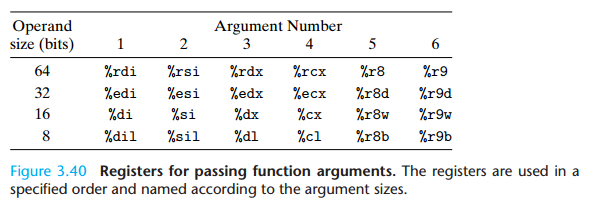

2. There size of the pointer of any data type is 64 bits in a x86-64 machine, so `(%rdx)` might be an integer pointer. 
3. By the convention in Figure 3.40, we can know that `%edi` is the first argument and is added by a pointer `%(rdx)` in the third place. Therefore, we can infer that `x` is the first argument and its type is integer. Apparently, `%(rdx` is an integer pointer `int ` which stores `t`. 
4. In the line 4: `movslq %edi, %rdi`, we can infer that `t` is a sign integer. `%rsi` is a sign long, so `*q` is a pointer of signed long type in the second place.

### Practice Problem 3.52

My answers are different from the standard ones on the book, but, in general, they are correct except for the answer of question D. 

A. `%rbx` is used to store the original value of the argument `x`.

B. `pushq %rbx` indicates that the `x` of the caller's  is stored in the stack. 

`pop1 %rbx` means that the `x` of a callee's is restored to `%rbx`. 

C. 

```assembly
rfact:   # The start of a function.
	pushq %rbx  # Move the value in %rbx to the top of the current stack.
	movq %rdi, %rbx # Since 'x' is in %rdi, this instruction moves it to %rbx.
	movl $1, %eax  # Move the immidiate 1 to %eax.
	testq %rdi, %rdi  # To test the logical operation of x&x.
	jle .L11  # If "x&x" is less than or equals 0, jump to L11.
	leaq -1(%rdi), %rdi  # Decrement x by 1.
	call rfact   # Calling the function "rfact"
	imulq %rbx, %rax  # x multiply the return value of rfact.
.L11
	popq %rbx  # Pop out the return of a callee to %rbx. 
	ret  # return. 
```

D. The register `%rsp` was not used. (Wrong!)

## Chapter 4

### Practice Problem 4.1

Note that the code starts at address of `0x100` means that the first byte of the byte encoding of the Y86 instructions is in it. The following sequence of code is put behind it.

### Practice Problem 4.3

Tips:

- In Y86 instruction set, there isn't any instructions adding an immediate to a register directly. Consequently, any operation of adding an immediate to a register in IA32 should be decomposed two instructions in Y86. As an illustration, `addl $4 %ecx` is converted to `irmovl $4 %ebx` and `addl %ebx, %ecx` as we can see in Page 380.
- There are only a few Y86 instruction set and note the  type of operands which are different of that of IA32. Some complicated Instructions that are not included in Y86 should be implemented with multiple Y86 instructions. 

The C code of the problem is as follows.

```c
#include <stdio.h>
int rSum(int *Start, int Count)
{
	if (Count < 0)
		return 0;
	return *Start + rSum(Start + 1, Count - 1);
}
```


The following assembly code was generated by the following command in a x86_64 machine. 

`> gcc -S -m32 p4.3_rSum.c  -o test_rSum_32.s ` 

The IA32 code which was generated in my machine is different from the answer due the version of two machines. I converted my IA32 code to Y86 assembly.

```assembly
	.file	"p4.3_rSum.c"
	.text
	.globl	rSum
	.type	rSum, @function
rSum:
.LFB0:
	.cfi_startproc
	pushl	%ebp
	.cfi_def_cfa_offset 8
	.cfi_offset 5, -8
	movl	%esp, %ebp
	.cfi_def_cfa_register 5
	pushl	%ebx
	subl	$20, %esp
	.cfi_offset 3, -12
	cmpl	$0, 12(%ebp)  # "Count" is in 12(%ebp) of the current stack frame.
	jns	.L2 # If the latest condition code indicates 12(%ebp) is Nonnegative, jump to .L2
	movl	$0, %eax
	jmp	.L3
.L2:
	movl	8(%ebp), %eax # Move "Start"(the value of a pointer, the address) to %eax.
	movl	(%eax), %ebx  # Move "*Start"(the value of a variable) to %ebx.
	movl	12(%ebp), %eax # Move "Count" to %eax.
	leal	-1(%eax), %edx # Count - 1.
	movl	8(%ebp), %eax # Move "Start"(address, pointer) to %eax.
	addl	$4, %eax  # Start + 1.
	movl	%edx, 4(%esp) # Move "Count" to 4(%esp)
	movl	%eax, (%esp)  # Move "Start"(the value of a pointer, address) to (%esp)
	call	rSum 
	addl	%ebx, %eax # Add "*Start" to "Count".
.L3:
	addl	$20, %esp 
	popl	%ebx  # The value of %eax of the previous stack is in (%esp).
	.cfi_restore 3
	popl	%ebp
	.cfi_restore 5
	.cfi_def_cfa 4, 4
	ret
	.cfi_endproc
.LFE0:
	.size	rSum, .-rSum
	.ident	"GCC: (GNU) 4.8.5 20150623 (Red Hat 4.8.5-44)"
	.section	.note.GNU-stack,"",@progbits
```

Y86 code

```assembly
rSum:
pushl	%ebp
movl	%esp, %ebp
pushl	%ebx
# The following two instructions implements `subl $20, %esp` in IA32.
irmovl	$20, %ecx
subl	%ecx, %esp   
# compl 12(%ebp)
mrmovl	12(%ebp), %ecx
andl	%ecx, ecx
jns		.L2
irmovl	$0, %eax
jmp		.L3

.L2
mrovl	8(%ebp), %eax
mrovl	(%eax), %ebx 
mrovl	12(%ebp), %eax
# leal	-1(%eax), %edx
subl	$1, %eax
rrmovl	%eax, %edx
mrmovl	8(%ebp), %eax
# addl	%4, %eax
irmovl	$4, %ecx
rrmovl	%ecx, %eax
rmovl	%edx, 4(%esp)
rmovl	%eax, (%esp)
call	rSum
addl	%ebx, %eax
.L3:
irmovl	$20, %ecx
rrmovl 	%ecx, %esp
popl	%ebx
popl	%ebp
ret
```

### Practice Problem 4.11

Specific

`irmovl $128, %esp`

$icode:ifun \leftarrow M_1[0x00e] =3:0$

$rA:rB \leftarrow M_1[0x00f]=f:4$ 

$valC \leftarrow M_4[0x010]=0x00,00,00,80(128)$.  It is little endian. 

$valP \leftarrow 0x00e + 6 = 0x014$

